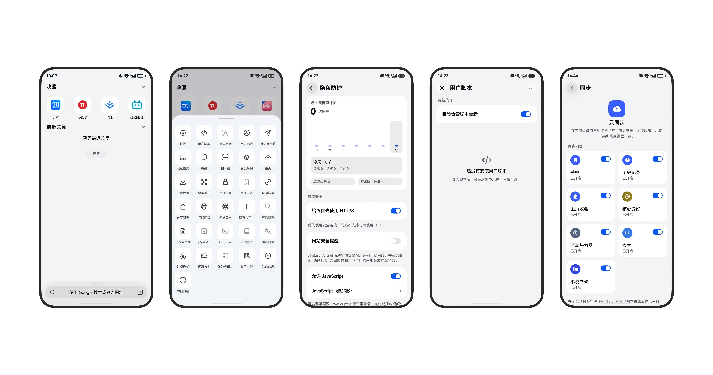
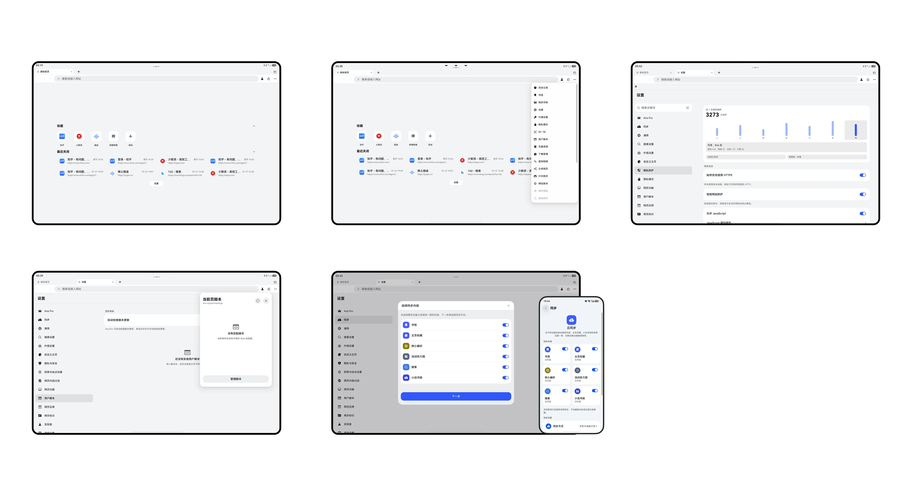

<p align="center">
  
</p>

<h1 align="center">Aira</h1>

<p align="center">
  <a href="README.md">中文</a> |
  <strong>English</strong>
</p>

<p align="center">
  <a href="https://appgallery.huawei.com/app/detail?id=com.aira.browser&channelId=SHARE&source=appshare"></a>
</p>

<p align="center">
  <a href="LICENSE"></a>
  <a href="https://t.me/airabrowser"></a>
</p>

Aira is an open-source HarmonyOS NEXT browser, released under GPL-3.0. The same repository also contains a desktop sync extension and a single-owner service for self-hosted sync.

Browsing, bookmarks, history, downloads, filtering, scripts, and the homepage can all be done on device. Community does not depend on Aira's official cloud or a Huawei account. To sync across devices, use your own WebDAV or Personal Server.

## Interface

Screenshots of the real interface:

<p align="center">
  
</p>
<p align="center">
  
</p>

## Features

### Browsing

- Native HarmonyOS NEXT client for phones, tablets, and 2-in-1 devices.
- Multiple tabs, restore on launch, background tab resource management, and automatic closing of tabs by unused time.
- A drag-to-reorder bottom toolbar, with adjustable appearance, theme, app icon, and top immersion.
- A custom homepage you can write yourself, and support for installing a site as a desktop app.
- Keyboard shortcuts and a two-column settings layout on large screens.

### Privacy and security

- Private browsing is stored separately from normal browsing data. Entry can require identity verification, and private tab previews can be blurred.
- Ad and web content filtering, with custom rules and manual element hiding.
- Tracking protection, cookie policy, site permissions, external app launch control, and secure DNS.
- An on-device password vault and autofill.
- Local backup import and export. Community does not connect to the official cloud by default, and does not send browsing data to Aira servers.

### Web capabilities

- Userscripts.
- Webpage translation, with a configurable translation service.
- Download manager: save location, segmented downloads, failure recovery, and private downloads.
- Reader mode and offline pages.
- Novel mode and a novel bookshelf.
- Webpage video takeover.
- Custom User-Agent.
- In-app proxy.
- Switchable search engines. The address bar uses local suggestions.

### Sync and cross-device

Available in Community:

- User-chosen WebDAV: bookmarks, homepage favorites, the novel bookshelf, and common settings.
- Self-hosted Personal Server: bookmarks, history, homepage favorites, the novel bookshelf, common settings, plus Page Push and Cross-device Tabs.
- The Aira-sync desktop extension, which connects Chromium and Firefox to the same Personal Server.

The Official store package also integrates Huawei Account, Huawei Cloud Space, Aira Cloud, and IAP. Those are not in the default Community build.

## Download

Unsigned Community HAPs are published on [GitHub Releases](https://github.com/mason173/aira-browser/releases). The bundle name is `org.aira.browser`. Sign it yourself with matching signing material before sideloading. This is not the Official store package on Huawei AppGallery.

## Repository conventions

- The browser and the extension are built as **Community** or **Official** from the **same commit**.
- A Community build does not need Aira production credentials and does not depend on official hosted services.
- Personal Server is a single-owner, paired-device service. It has no registration, password accounts, organizations, roles, membership, billing, referral, or Huawei sign-in.
- Local data, WebDAV, and Personal Server do not require an Aira membership.
- Aira production services, Admin, Huawei project configuration, signing material, and deployment keys are not in this repository.

## Components

| Component | Location | Responsibility |
| --- | --- | --- |
| HarmonyOS client | [`AiraBrowser/`](AiraBrowser/README.md) | ArkTS/ArkUI browser shell, local storage, and provider integration |
| Desktop extension | [`extensions/aira-sync/`](extensions/aira-sync/README.md) | Chromium/Firefox UI, background runtime, and cross-device client |
| Personal Server | [`services/personal-server/`](services/personal-server/README.md) | Node.js/Docker sync, pairing, Page Push, and tab presence API |
| Shared resources | [`resources/`](resources/) and [`docs/`](docs/) | Icons, notices, architecture decisions, and protocol docs |

## Architecture at a glance

The client stores local browsing state and selects one remote provider for each sync domain. WebDAV and Personal Server are publicly available. Official builds can also use Aira Cloud and Huawei Cloud Space.

Personal Server provides discovery, a reusable pairing code, and APIs for bookmarks, history, personalization, the novel bookshelf, Page Push, and Cross-device Tabs. It uses per-device bearer credentials, stores only credential hashes, and has no user account system.

Read these before changing the protocol:

- [Open-source distribution boundary](docs/open-source-distribution.md)
- [Personal Server self-hosting](docs/self-hosting.md)
- [Personal Server protocol](services/personal-server/docs/protocol.md)
- [Personal Server operations](services/personal-server/docs/operations.md)
- [Aira-sync development guide](extensions/aira-sync/README.md)
- [HarmonyOS client development guide](AiraBrowser/README.md)

## Development environment

| Scope | Requirement |
| --- | --- |
| Repository scripts | Node.js `18.20.8`, as pinned in `.node-version` / `.nvmrc` |
| Aira-sync | Node.js 24.x and npm (see `extensions/aira-sync/.node-version`) |
| Personal Server | Node.js 20 or newer, or Docker with Compose |
| HarmonyOS client | DevEco Studio, HarmonyOS NEXT SDK/API 23 or newer, and `ohpm` |

After cloning, run commands from the repository root unless a section says otherwise:

```bash
git clone https://github.com/mason173/aira-browser.git
cd aira-browser
```

## Run Personal Server locally

The fastest check, without persisting data:

```bash
cd services/personal-server
npm ci
npm run check
```

A persistent local instance with Docker:

```bash
cd services/personal-server
cp .env.example .env
docker compose up -d --build
docker compose exec aira-server cat /data/setup-code
```

Connect a development client with the printed pairing code. The same code can pair every device. Compose binds `127.0.0.1:8787` by default. Put a TLS reverse proxy in front before exposing it. Backup, restore, upgrades, reverse proxy, and credential revocation are covered in the service README and the operations doc.

## Build Aira-sync

```bash
cd extensions/aira-sync
npm ci
npm run typecheck
npm test
npm run build:community
```

The Community output is in `build/community/` and can be loaded as an unpacked extension in a Chromium-based browser. The public Community manifest has a fixed extension ID `efehgppkhnkjamcpbipclfmmofdildji`.

Official builds inject private routes through `AIRA_SYNC_OFFICIAL_API_ROUTES`. This repository does not contain production URLs. Full route fields and packaging commands are in the extension README.

## Build the HarmonyOS client

Open `AiraBrowser/` in DevEco Studio, or use the build script at the repository root:

```bash
cd AiraBrowser
ohpm install
cd ..
AIRA_DISTRIBUTION=community AIRA_ALLOW_UNSIGNED_BUILD=1 SKIP_INSTALL=1 ./scripts/build-aira-browser.sh
```

This produces an unsigned Community HAP for CI and source verification. Installing it on a device requires a local signature for `org.aira.browser`. An Official build also needs private AGConnect, production routes, and a signature for `com.aira.browser`:

```bash
AIRA_DISTRIBUTION=official SKIP_INSTALL=1 ./scripts/build-aira-browser.sh
```

Do not commit `agconnect-services.json`, a build-profile with encrypted passwords, `.p12` / `.p7b` files, or other signing material. Official signing and install scripts are a private packaging flow and are not in this repository. For Community builds, see [`AiraBrowser/README.md`](AiraBrowser/README.md).

## Community and Official

The two distributions share source and tests. They differ only in build-time identity and private capability inputs:

| Capability | Community | Official |
| --- | --- | --- |
| Local browsing and local storage | Available | Available |
| User-chosen WebDAV | Available | Available |
| Personal Server sync and Cross-device Tabs | Available | Available |
| Huawei Account / Huawei Cloud Space | Not configured | Private Huawei project and approval |
| Aira Cloud hosted service | Not configured | Private service routes and entitlements |
| Huawei IAP / Aira Pro | Not configured | Private production service |

Read [`docs/open-source-distribution.md`](docs/open-source-distribution.md) before adding a provider or changing the distribution boundary. Do not keep a long-lived Community fork, and do not copy Official-only pages into a second source tree.

## Contributing

Put cross-component protocol changes in the same pull request, and run checks for every component you change. Keep policy, transport, persistence, and orchestration in the existing `core`, `services`, `data`, or `features` owners. Do not pile them into native UI shells.

Before opening a pull request:

```bash
# Repository root
git diff --check

# Aira-sync changes
(cd extensions/aira-sync && npm run typecheck && npm test)

# Personal Server changes
(cd services/personal-server && npm run check)
```

Review requirements are in [`CONTRIBUTING.md`](CONTRIBUTING.md). Report vulnerabilities privately, as described in [`SECURITY.md`](SECURITY.md). Do not attach device data, credentials, tokens, databases, backups, browser configuration, or production configuration to an issue or pull request.

## License

Original Aira source is available under [GPL-3.0-only](LICENSE). Third-party components keep their own licenses. See [`THIRD_PARTY_NOTICES.md`](THIRD_PARTY_NOTICES.md) and the notices in each component directory.

The license does not grant rights to the Aira name, logo, or other trademarks. See [`TRADEMARKS.md`](TRADEMARKS.md).

## Star History

[](https://star-history.com/#mason173/aira-browser&Date)
