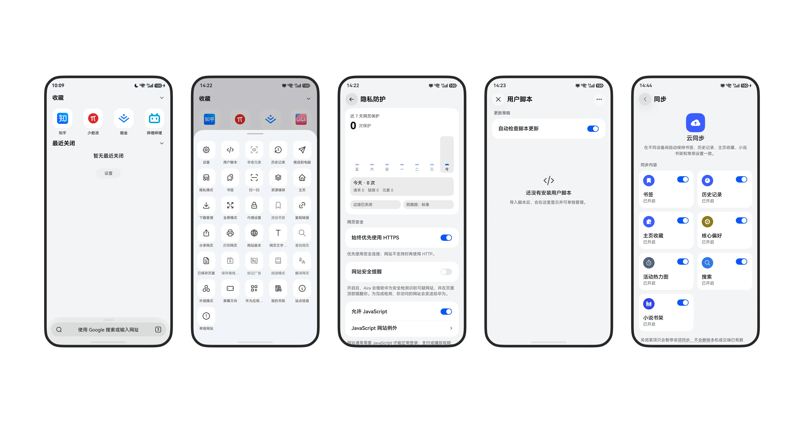
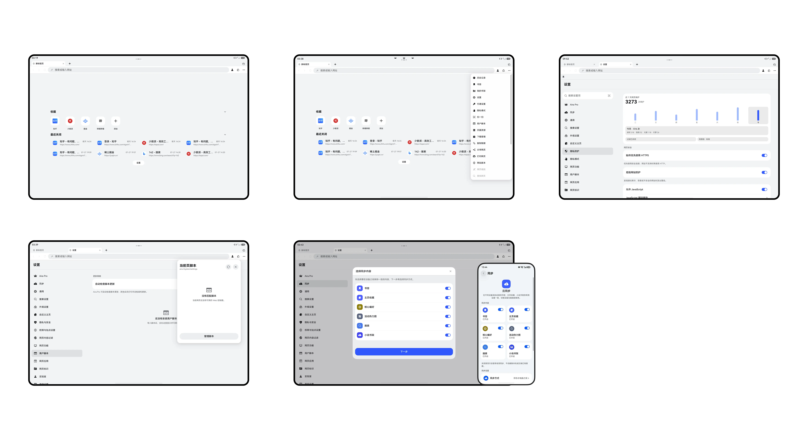

# Aira

Aira 是开源的鸿蒙 NEXT 浏览器，源码按 GPL-3.0 发布。同一仓库里还有桌面同步扩展，以及用于自建同步的单所有者服务。

浏览、书签、历史、下载、过滤、脚本和主页都可以在本机完成。Community 不依赖 Aira 官方云或华为账号；要跨设备，用你自己的 WebDAV 或 Personal Server。

## 界面

真实界面截图：

<p align="center">
  
</p>
<p align="center">
  
</p>

## 功能

### 浏览

- 鸿蒙 NEXT 原生客户端，支持手机、平板和 2in1。
- 多标签、启动恢复、后台标签页资源管理，以及按未使用时长自动关闭标签。
- 可拖拽排序的底部工具栏，外观、主题、应用图标和顶部沉浸可调。
- 自定义主页，可自己写页面；也支持把网站安装成桌面应用。
- 大屏有键盘快捷键和双栏设置。

### 隐私与安全

- 隐私模式与普通浏览数据分开保存，可要求进入时验证身份，并模糊私密标签预览。
- 广告与网页内容过滤，支持自定义规则和手动隐藏元素。
- 防跟踪、Cookie 策略、站点权限、外部应用跳转控制和安全 DNS。
- 本机密码保险箱与自动填充。
- 本地备份导入导出。Community 默认不连官方云，也不会把浏览数据交到 Aira 服务器。

### 网页能力

- 用户脚本。
- 网页翻译，可配置翻译服务。
- 下载管理：保存位置、分片、失败恢复、私密下载。
- 阅读模式和离线页面。
- 小说模式与小说书架。
- 网页视频接管。
- 自定义网页标识（User-Agent）。
- 应用内代理。
- 搜索引擎可切换，地址栏用本地建议。

### 同步与跨端

Community 可用：

- 用户自选 WebDAV：书签、主页收藏、小说书架和常用设置。
- 自建 Personal Server：书签、历史、主页收藏、小说书架、常用设置，以及页面推送和跨端标签。
- 桌面扩展 Aira-sync，把 Chromium / Firefox 接到同一套 Personal Server。

Official 商店包另外接入华为账号、华为云空间、Aira 云和 IAP。这些不在 Community 默认构建里。

## 下载

Community 未签名 HAP 发在 [GitHub Releases](https://github.com/mason173/aira-browser/releases)。包名是 `org.aira.browser`，需要你自己用对应签名材料签名后再侧载。这不是华为应用市场里的 Official 商店包。

## 仓库约定

- 浏览器和扩展从**同一提交**打出 **Community** 或 **Official** 两种发行版。
- Community 构建不需要 Aira 生产凭证，也不依赖官方托管服务。
- Personal Server 是单所有者、配对设备服务。没有注册、密码账号、组织、角色、会员、计费、推荐或华为登录。
- 本地数据、WebDAV 和 Personal Server 不需要 Aira 会员。
- Aira 生产服务、Admin、华为项目配置、签名材料和部署密钥不在本仓库。

## 组件

| 组件 | 位置 | 开发职责 |
| --- | --- | --- |
| 鸿蒙客户端 | [`AiraBrowser/`](AiraBrowser/README.md) | ArkTS/ArkUI 浏览器壳、本地存储、Provider 接入 |
| 桌面扩展 | [`extensions/aira-sync/`](extensions/aira-sync/README.md) | Chromium/Firefox 界面、后台运行时、跨端客户端 |
| Personal Server | [`services/personal-server/`](services/personal-server/README.md) | Node.js/Docker 同步、配对、页面推送、标签在线 API |
| 共享资源 | [`resources/`](resources/) 与 [`docs/`](docs/) | 图标、声明、架构决策、协议文档 |

## 架构速览

客户端保存本地浏览状态，并在每个同步域上选择一个远程 Provider。公开可用的是 WebDAV 和 Personal Server；Official 构建还可以使用 Aira 云和华为云空间。

Personal Server 提供发现、一次性配对、书签、历史、个性化、小说书架、页面推送和跨端标签接口。它使用按设备签发的 bearer 凭证，只存储凭证哈希，没有用户账号系统。

改协议之前先读这些约定：

- [开源发行边界](docs/open-source-distribution.md)
- [Personal Server 自托管](docs/self-hosting.md)
- [Personal Server 协议](services/personal-server/docs/protocol.md)
- [Personal Server 运维](services/personal-server/docs/operations.md)
- [Aira-sync 开发说明](extensions/aira-sync/README.md)
- [鸿蒙客户端开发说明](AiraBrowser/README.md)

## 开发环境

| 范围 | 要求 |
| --- | --- |
| 仓库脚本 | `.node-version` / `.nvmrc` 中的 Node.js `18.20.8` |
| Aira-sync | Node.js 24.x 和 npm（见 `extensions/aira-sync/.node-version`） |
| Personal Server | Node.js 20 或更新，或带 Compose 的 Docker |
| 鸿蒙客户端 | DevEco Studio、HarmonyOS NEXT SDK/API 23 或更新，以及 `ohpm` |

克隆后默认在仓库根目录执行命令，除非某节另有说明：

```bash
git clone https://github.com/mason173/aira-browser.git
cd aira-browser
```

## 本地运行 Personal Server

不落持久数据、最快验证服务是否正常：

```bash
cd services/personal-server
npm ci
npm run check
```

用 Docker 跑一份会持久化的本地实例：

```bash
cd services/personal-server
cp .env.example .env
docker compose up -d --build
docker compose exec aira-server cat /data/setup-code
```

用打印出的一次性配对码连接开发客户端。默认 Compose 绑定 `127.0.0.1:8787`；要对外访问，先加 TLS 反代。备份、恢复、升级、反代和凭证吊销见服务 README 与运维文档。

## 构建 Aira-sync

```bash
cd extensions/aira-sync
npm ci
npm run typecheck
npm test
npm run build:community
```

Community 产物在 `build/community/`，可在 Chromium 内核浏览器里以未打包扩展加载。公开 Community 清单有固定扩展 ID `efehgppkhnkjamcpbipclfmmofdildji`。

Official 构建通过 `AIRA_SYNC_OFFICIAL_API_ROUTES` 注入私有路由，本仓库不含生产地址。完整路由字段和打包命令见扩展 README。

## 构建鸿蒙客户端

用 DevEco Studio 打开 `AiraBrowser/`，或使用根目录构建脚本：

```bash
cd AiraBrowser
ohpm install
cd ..
AIRA_DISTRIBUTION=community AIRA_ALLOW_UNSIGNED_BUILD=1 SKIP_INSTALL=1 ./scripts/build-aira-browser.sh
```

这会打出供 CI 和源码核验用的未签名 Community HAP。装到设备需要 `org.aira.browser` 的本地签名。Official 构建另外需要私有 AGConnect、生产路由，以及 `com.aira.browser` 的签名：

```bash
AIRA_DISTRIBUTION=official SKIP_INSTALL=1 ./scripts/build-aira-browser.sh
```

不要提交 `agconnect-services.json`、带加密密码的 build-profile、`.p12` / `.p7b` 或其他签名材料。Official 签名和装机脚本是私有打包流程，不在本仓库。Community 构建见 [`AiraBrowser/README.md`](AiraBrowser/README.md)。

## Community 与 Official

两种发行版共用源码和测试，差别只在构建时的身份和私有能力输入：

| 能力 | Community | Official |
| --- | --- | --- |
| 本地浏览与本地存储 | 可用 | 可用 |
| 用户自选 WebDAV | 可用 | 可用 |
| Personal Server 同步与跨端标签 | 可用 | 可用 |
| 华为账号 / 华为云空间 | 未配置 | 私有华为项目与审批 |
| Aira 云托管服务 | 未配置 | 私有服务路由与权益 |
| 华为 IAP / Aira Pro | 未配置 | 私有生产服务 |

增改 Provider 或发行边界前先读 [`docs/open-source-distribution.md`](docs/open-source-distribution.md)。不要长期分叉 Community，也不要把 Official 专用页面复制成第二套源码。

## 贡献流程

跨组件协议改动放在同一个 pull request，改到的组件都要跑检查。策略、传输、持久化和编排放进现有的 `core`、`services`、`data` 或 `features`，不要堆进原生 UI 壳。

提 PR 前：

```bash
# 仓库根目录
git diff --check

# Aira-sync 改动
(cd extensions/aira-sync && npm run typecheck && npm test)

# Personal Server 改动
(cd services/personal-server && npm run check)
```

评审要求见 [`CONTRIBUTING.md`](CONTRIBUTING.md)，漏洞私下报告见 [`SECURITY.md`](SECURITY.md)。不要在 issue 或 PR 里附带设备数据、凭证、token、数据库、备份、浏览器配置或生产配置。

## 许可

Aira 原创源码按 [GPL-3.0-only](LICENSE) 提供。第三方组件保留各自许可，见 [`THIRD_PARTY_NOTICES.md`](THIRD_PARTY_NOTICES.md) 及各组件目录中的声明。

许可不授予 Aira 名称、标识或其他商标权利。见 [`TRADEMARKS.md`](TRADEMARKS.md)。

## Star History

[](https://star-history.com/#mason173/aira-browser&Date)
