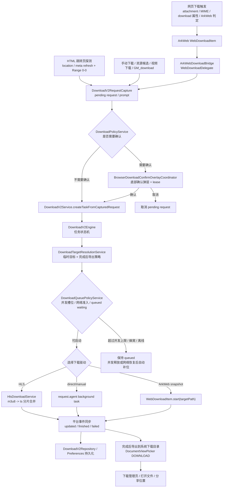

# Aira Browser Download Current Architecture

调研对象：`<repo>`

调研时间：2026-07-03

## 结论摘要

Aira 当前下载链路已经不再是简单的 URL 后缀判断。标准网页下载的目标主入口是 ArkWeb 的
`WebDownloadDelegate` / `WebDownloadItem`：Web controller attach 时会注入下载 delegate，ArkWeb 判定为下载后，Aira 在
`onBeforeDownload` 收到平台下载对象，再进入自己的 V2 下载服务、确认弹层、任务状态机和持久化记录。

2026-07-03 的华为对齐修正后，运行时不再让 `onDownloadStart` 自动发起下载确认。`onDownloadStart` 只保留诊断和用户脚本安装识别；
标准网页下载只能由 ArkWeb `WebDownloadDelegate.onBeforeDownload` / `WebDownloadItem` 驱动。这样取消 platform prompt 后，不会再有裸
URL fallback 复活出第二个 manual prompt。

同时，Aira 额外做了几类“辅助发现”：

- 手动 URL / 长按资源 / 页面菜单下载。
- 页面资源嗅探：网络请求、DOM 扫描、MIME、Content-Disposition、媒体元素、Performance entries、脚本文本中的媒体 URL。
- 站点视频下载适配：当前有 Bilibili、HLS、通用视频计划。
- 用户脚本 `GM_download` / native download bridge。
- 小 HTML 跳转页探测：对手动下载的 HTML 跳转页做轻量解析，再确认目标是否像真实文件。

所以 Aira 的下载架构可以概括为：**标准下载信任 ArkWeb delegate；`onDownloadStart` 不创建下载 prompt；非标准资源下载靠显式入口补充；所有入口最终尽量收敛到 DownloadV2Service 统一建任务、确认、落盘、恢复和展示。**

当前和华为浏览器的方向接近，尤其是“标准下载识别交给 ArkWeb”这一点。但 Aira 仍处于“旧
`DownloadRuntimeService` facade + 新 `DownloadV2Service` 内核”的迁移状态，并且平台 delegate 事件进入 V2 时仍依赖
`DownloadRuntimeService.activeBoundary` 这个全局活跃边界。华为反汇编里更像是按 Web controller / WebPageController 绑定 delegate
并围绕 `WebDownloadItem` 的 `guid/requestId` 建任务；Aira 目前的全局 boundary 在多 tab、子窗口、后台 runtime 或事件延迟场景下更容易把下载归属到错误上下文。

## 关键源码入口

平台下载层：

- `AiraBrowser/entry/src/main/ets/platform/download/PlatformDownloadAdapter.ets`
- `AiraBrowser/entry/src/main/ets/platform/download/ArkWebDownloadBridge.ets`
- `AiraBrowser/entry/src/main/ets/platform/download/RequestAgentDownloadAdapter.ets`

V2 下载核心：

- `AiraBrowser/entry/src/main/ets/services/downloadv2/DownloadV2Service.ets`
- `AiraBrowser/entry/src/main/ets/core/downloadv2/DownloadV2Engine.ets`
- `AiraBrowser/entry/src/main/ets/domain/downloadv2/DownloadV2TaskEntity.ets`
- `AiraBrowser/entry/src/main/ets/domain/downloadv2/DownloadV2StateMachine.ets`
- `AiraBrowser/entry/src/main/ets/data/downloadv2/DownloadV2Repository.ets`
- `AiraBrowser/entry/src/main/ets/data/downloadv2/DownloadV2RecordStore.ets`

下载策略和文件处理：

- `AiraBrowser/entry/src/main/ets/services/download/DownloadRuntimeService.ets`
- `AiraBrowser/entry/src/main/ets/services/download/DownloadPolicyService.ets`
- `AiraBrowser/entry/src/main/ets/services/download/DownloadQueuePolicyService.ets`
- `AiraBrowser/entry/src/main/ets/services/download/DownloadNetworkPolicyService.ets`
- `AiraBrowser/entry/src/main/ets/services/download/DownloadFileNameService.ets`
- `AiraBrowser/entry/src/main/ets/services/download/DownloadFileResolutionService.ets`
- `AiraBrowser/entry/src/main/ets/services/download/DownloadFollowupService.ets`

浏览器 UI / 壳接入：

- `AiraBrowser/entry/src/main/ets/app/bootstrap/BrowserAppRuntime.ets`
- `AiraBrowser/entry/src/main/ets/core/web/WebControllerBootstrapper.ets`
- `AiraBrowser/entry/src/main/ets/core/browser/BrowserDownloadConfirmOverlayCoordinator.ets`
- `AiraBrowser/entry/src/main/ets/core/browser/BrowserDownloadPromptLeaseCoordinator.ets`
- `AiraBrowser/entry/src/main/ets/core/browser/BrowserDownloadNavigationStateCoordinator.ets`
- `AiraBrowser/entry/src/main/ets/core/browser/BrowserDownloadNavigationTransactionCoordinator.ets`
- `AiraBrowser/entry/src/main/ets/app/pages/BrowserShellPage.ets`
- `AiraBrowser/entry/src/main/ets/app/components/browser/BrowserDownloadConfirmSheet.ets`
- `AiraBrowser/entry/src/main/ets/app/components/browser/BrowserDownloadManagementScreen.ets`

媒体资源发现和资源下载：

- `AiraBrowser/entry/src/main/ets/core/browser/media/BrowserMediaDiscoveryCoordinator.ets`
- `AiraBrowser/entry/src/main/ets/core/browser/media/BrowserMediaDiscoverySurfaceCoordinator.ets`
- `AiraBrowser/entry/src/main/ets/services/media/MediaCandidateProjector.ets`
- `AiraBrowser/entry/src/main/ets/features/mediaDiscovery/MediaDownloadProjectionModels.ets`
- `AiraBrowser/entry/src/main/ets/services/downloadv2/HlsDownloadService.ets`
- `AiraBrowser/entry/src/main/ets/services/userscripts/UserScriptNativeDownloadService.ets`

## 总体流程



## 1. ArkWeb 下载是主入口

`BrowserShellPage.buildWebRuntimeBootstrapConfig()` 会把 `downloadDelegate: this.downloadService.getDelegate()` 放入 Web runtime 配置。`WebControllerBootstrapper.bootstrapAttachedController()` 在 controller attach 后调用 `controller.setDownloadDelegate(config.downloadDelegate)`。

`DownloadRuntimeService.getDelegate()` 触发 `ArkWebDownloadBridge.getDelegate()`。这个 bridge 内部创建 `new webview.WebDownloadDelegate()`，同时调用 `webview.WebDownloadManager.setDownloadDelegate(this.delegate)`，再注册：

- `onBeforeDownload`
- `onDownloadUpdated`
- `onDownloadFinish`
- `onDownloadFailed`

ArkWeb 触发 `onBeforeDownload` 后，`ArkWebDownloadBridge` 把 `WebDownloadItem` 读成统一的 `PlatformDownloadSnapshot`，字段包括：

- `guid`
- `url`
- `originalUrl`
- `suggestedFileName`
- `totalBytes`
- `receivedBytes`
- `currentSpeed`
- `state`
- `lastErrorCode`
- `mimeType`
- `method`
- `referer`
- `platformResumeToken`

随后 `DownloadRuntimeService` 把平台事件交给 `DownloadV2Service.consumePlatformEvent()`。如果是 `before_download`，就进入待确认请求；如果是进度/完成/失败，则同步到已有任务。

这一条链路是 Aira 最像华为浏览器的部分：**下载识别交给 ArkWeb，Aira 只处理确认、保存路径、任务状态和 UI。**

## 2. onDownloadStart 只做诊断，不创建下载 prompt

Web 组件也接了 `.onDownloadStart(...)`：

- `HostedWebNode.ets`
- `BrowserDirectChildWindowWebHost.ets`
- `BrowserWebEventHostCoordinator.ets`
- `BrowserShellPage.handleDownloadStart(...)`

当前 `handleDownloadStart` 只做页面壳转发，把 ArkWeb 的 `OnDownloadStartEvent` 交给
`BrowserDownloadEventCoordinator.handleWebDownloadStart(...)`。真正策略在 coordinator 里：

- 先记录 `on_download_start` 诊断。
- 判断是否是用户脚本安装链接。
- 普通文件下载不再从 `onDownloadStart` 启动 probe，也不再创建 manual prompt。

这点很重要：Aira 的标准下载由 `WebDownloadDelegate.onBeforeDownload` 秒级建 prompt；取消也只取消这个 ArkWeb `guid/requestId`。如果
`onDownloadStart` 再创建一个 naked-URL manual prompt，就会偏离华为并造成“取消后又弹一次”。

## 3. DownloadV2Service 是当前下载内核

`DownloadV2Service` 做四件事：

1. 捕获请求：平台事件和手动下载都被包装为 `DownloadV2CapturedRequest`。
2. 决定是否弹确认：通过 `DownloadPolicyService.resolveSavePolicy(...)` 判断。
3. 创建任务：交给 `DownloadV2Engine` 建 `DownloadV2TaskEntity`。
4. 启动下载：根据来源选择 ArkWeb、request.agent 或 HLS 驱动。

任务状态由 `DownloadV2StateMachine` 管理：

- `created`
- `awaiting_confirmation`
- `queued`
- `running`
- `paused`
- `completed`
- `failed`
- `canceled`
- `removed`

任务实体保存边界和运行态：

- 请求上下文：URL、原 URL、method、sourcePageUrl、sourceHost、UA、Referer、MIME、Content-Disposition、headers。
- 进度：总大小、已接收大小、速度。
- 持久化：临时文件路径、系统下载目录 URI、下载驱动、续传模式、分片计划等。
- 运行时：平台 taskId/token、ArkWeb serialize token、resumeCapability。
- 隐私边界：windowId、profileId、privacyMode、dataScope。

## 4. DownloadRuntimeService 是兼容 facade

`DownloadRuntimeService` 仍然是页面和组件看到的主要接口：

- `getDelegate()`
- `requestManualDownloadPrompt(...)`
- `requestManualDownload(...)`
- `confirmPendingDownload(...)`
- `cancelPendingDownload(...)`
- `listTasks(...)`
- `pauseTask(...)`
- `resumeTask(...)`
- `retryTask(...)`
- `cancelTask(...)`
- `openFile(...)`
- `openLocation(...)`

但从源码看，新下载任务和操作基本都委托给 `DownloadV2Service`。它主要负责：

- 把 V2 任务转成旧 UI 能理解的 `DownloadTaskState`。
- 给管理页构造状态文案、进度、按钮权限。
- 按 profile/privacy/dataScope/window 过滤任务。
- 处理私密窗口关闭时的临时文件和记录清理。
- 把 info/error/prompt/list callbacks 转给页面。

也就是说它是“旧 API 外壳 + V2 内核桥接层”。

这里有一个和华为差异很大的边界点：`DownloadRuntimeService.initialize()` 收到 `ArkWebDownloadBridge` 的平台事件后，用当前
`activeBoundary` 调用 `DownloadV2Service.consumePlatformEvent(...)`。`activeBoundary` 由
`BrowserShellPage.syncDownloadBoundary()` 在页面出现、切 tab、前后台跟随等时机同步，来源是当前活跃窗口和当前 URL。

这在单 tab、前台点击下载时大多能工作，但它不是“事件来自哪个 Web controller，就携带哪个 tab/window/profile boundary”的模型。华为浏览器反汇编里更强调
Web controller / WebNode controller 上绑定 delegate，再把 `WebDownloadItem` 包装为下载任务。Aira 长期要对齐华为，应把 platform
download event 的边界和触发它的 Web runtime/controller 绑定，而不是只依赖全局当前活跃页面。

## 5. 确认弹层和重复弹窗控制

`DownloadV2RequestCapture` 会把待下载请求变成 `DownloadV2Prompt`：

- 标题：`是否下载文件？`
- 提示：`下载确认只对本次点击生效。取消后不会再次自动触发。`
- 按钮：下载 / 取消

2026-07-03 对齐华为多下载行为后，pending prompt 按 FIFO 队列语义推进：新增 platform/manual request 只入队，`onPromptChanged`
始终发布当前队首 prompt，而不是发布最新捕获的 prompt。这样一次页面动作触发 4 个 ArkWeb `before_download` 时，确认弹层会按
requestId 逐个展示，不会因为后来的 prompt 替换前面的 prompt，导致旧 guid 被 overlay lease 标记为 replaced 后无法再确认。

同一轮还把标准平台下载的重复判断从 URL 改成 ArkWeb guid：`before_download` 只在同 guid 已有 pending platform request 或已有非终态
task 时才忽略。华为的基线是围绕 `WebDownloadItem.getGuid()` / requestId 建任务，URL 只能辅助手动 fallback 提升为 platform
request，不能吞掉多个独立下载。

页面回调到 `BrowserDownloadConfirmOverlayCoordinator`，它负责：

- 挂载自定义底部弹层。
- 通过 `BrowserDownloadPromptLeaseCoordinator` 管理 lease，确认/取消/消失后同一 guid 2 分钟内不会重复弹。
- 确认时调用 `DownloadRuntimeService.confirmPendingDownload(guid)`。
- 取消时调用 `DownloadRuntimeService.cancelPendingDownload(guid)`。
- 对 PDF / inline document 做例外处理：如果不是 attachment 且 MIME/URL 像 PDF，会放弃下载 prompt，把它当可见文档导航。

这个设计能减少重复弹窗和 PDF 误弹，但也意味着“打开 PDF”和“下载 PDF”会被区别对待。

## 6. 下载导航保护

下载触发经常表现为一次“页面导航到文件 URL”。如果直接把这个 URL 写入 tab state，下一次恢复可能打开的是下载链接而不是原网页。

Aira 用 `BrowserDownloadNavigationStateCoordinator` 和 `BrowserDownloadNavigationTransactionCoordinator` 做保护：

- 下载候选 URL 标记为 non-restorable。
- 弹确认时把 tab 的 URL / pendingUrl / history 回退到上一个可恢复页面。
- 跳过下载候选 URL 的 snapshot / tab state persistence。
- 确认、取消、恢复、晋升为可见文档都有 transaction phase。
- non-restorable guard 会持久化一小段时间，避免 app 崩溃或切后台后恢复到下载 URL。

这层对浏览器体验非常关键，也说明 Aira 已经在处理“下载不应该污染标签页历史/恢复”的问题。

## 7. 保存路径和文件名策略

文件名由 `DownloadFileNameService` 解析：

- 优先 `Content-Disposition` 的 `filename*` / `filename`。
- 其次 `suggestedFileName`。
- 再从 URL path 或 query 参数里找 `filename`、`file_name`、`name`、`download`、`fn`。
- 对泛名如 `download.bin`、`file.bin`、`index.html`、`未命名下载` 会尝试从 URL 重新推。
- 根据 MIME 或 URL 补常见后缀，例如 zip、rar、7z、pdf、apk、json、txt、jpg、png、mp4、mp3。
- 清理非法文件名字符。

目标决策由 `DownloadTargetResolutionService` 先收口，再由 `DownloadFileResolutionService` 执行落盘：

1. 创建任务前先解析保存策略：普通下载先写 app 临时路径，完成后选择系统下载位置；`session_temp_only` 私密下载只保留私密临时文件。
2. 临时文件仍位于应用私有目录：`filesDir/downloads/incomplete`。
3. 下载完成后，普通下载调用 `DocumentViewPicker.save()`，`pickerMode = DOWNLOAD`，把临时文件导出到系统下载目录。
4. 导出冲突不再把时间戳写进用户可见文件名，而是按浏览器习惯尝试 `file.ext`、`file (1).ext`、`file (2).ext`。
5. 如果用户取消系统保存，任务会保留 Aira 临时下载位置，下载管理页仍可尝试打开文件、分享位置，或重新保存到系统下载目录。
6. 打开文件或位置时，`DownloadFollowupService` 优先用 `finalFileUri`，否则尝试用临时路径转 URI，再走 `Want` 打开；失败时退到系统分享。

这一套保存策略比较安全，但和华为浏览器常见的“下载开始前确定最终目录/文件名”仍不完全一样：Aira 已经把目标决策前置到任务创建阶段，但下载主体仍先写私有临时目录，完成后再导出。

## 8. 并发队列

`DownloadQueuePolicyService` 是当前下载启动准入 owner。`DownloadV2Service` 在创建任务时会先把目标路径、文件名和驱动信息准备好并持久化为 `queued`，然后询问队列策略是否可以启动。

`DownloadNetworkPolicyService` 是下载网络状态 provider/policy：它基于官方 `@kit.NetworkKit.connection` 同步接口读取默认网络和 bearer type，再把 Wi-Fi、Ethernet、Cellular、Offline、Unknown 映射成下载准入结果。仓库已声明 `ohos.permission.GET_NETWORK_INFO`。

当前默认策略：

- 最多 3 个 `running` 下载并发。
- 超过上限的任务保持 `queued`，下载管理页显示等待中。
- Wi-Fi / Ethernet / unknown 网络立即允许启动。
- Cellular 默认等待 WLAN，任务保持 `queued`，并记录 `restartReason=waiting_wifi`。
- Offline 默认等待网络恢复，任务保持 `queued`，并记录 `restartReason=waiting_network`。
- running 任务完成、失败、取消或暂停后，调度器会选择最早准备好的 queued 任务启动。
- 下载服务初始化时会监听网络变化；切到 WLAN 或网络恢复后，queued 任务进入同一个调度入口。
- HLS、ArkWeb platform、request.agent direct/manual 都通过同一个调度入口。

这补上了华为式 waiting queue 和 wait-for-WLAN 的服务层骨架。还没做的是用户可选策略：蜂窝始终允许、每次询问、仅 WLAN、漫游策略，以及对应的确认弹窗/设置页。

## 9. 下载驱动：ArkWeb、request.agent、HLS

### ArkWeb platform driver

如果请求来自 `WebDownloadItem`，V2 会调用：

```text
platformAdapter.startDownload(guid, targetPath)
```

`ArkWebDownloadBridge.startDownload()` 优先执行：

```text
WebDownloadItem.start(targetPath)
```

如果 ArkWeb start 失败，会读取 snapshot 并创建 request.agent 后台任务作为兜底，然后取消 ArkWeb provisional item。

`3g.d.cn` 来源的标准 HTTP(S) `GET` APK 下载是一个针对真机续传故障的执行例外：ArkWeb 仍负责下载识别、GUID 和确认入口，但确认后由
`request.agent` 后台任务执行。原因是公开 ArkWeb API 只支持反序列化恢复失败/取消任务，不能恢复进程重启后的
`PAUSED` 下载；`request.agent` 则通过持久化 taskId、冷启动 `getTask()` 重连和 `resume()` 提供系统支持的恢复路径。
这个例外不使用新建 Range 任务覆盖 ArkWeb 预分配文件，也不改变其他站点的 ArkWeb 主执行路径。

### request.agent driver

手动下载、资源候选、站点视频 direct request，以及 ArkWeb start 失败后的兜底，会走 `RequestAgentDownloadAdapter`。

它使用 `request.agent.create(...)` 创建后台下载任务：

- `action: DOWNLOAD`
- `mode: BACKGROUND`
- `network: ANY`
- `metered: true`
- `roaming: true`
- `retry: true`
- `gauge: true`
- `saveas: targetPath`

它会尽量补齐 headers：

- 来源 request headers。
- `User-Agent`
- `Referer`
- Cookie：通过 `webview.WebCookieManager.fetchCookieSync(url, false)` 获取。

它还会保存 `platformTaskId` / `platformTaskToken`，支持 pause/resume/cancel/retry/reconnect。

### HLS driver

如果 request 是 m3u8/HLS，`DownloadV2Service` 会选择 `HlsDownloadService`：

- 解析 master playlist，选最高带宽/分辨率 variant。
- 解析 media playlist。
- 如果有加密分片，直接失败，当前版本不支持。
- 顺序下载分片到一个 `.ts` 输出文件。
- 支持进度回调和取消检测。
- 失败后 `resumeCapability` 是 `retry_only`，不是断点续传。

### RCP 分段下载

`RcpRangeDownloadProbeService` 和 `RcpStreamingSegmentedDownloadProbeService` 目前只在 test-lab / debug URL 里使用，是 POC，不在 `DownloadV2Service` 正式下载路径中。

## 10. 恢复和持久化

`BrowserAppRuntime` 创建共享实例：

- `sharedPlatformDownloadBridge`
- `sharedDownloadV2Service`
- `sharedDownloadRuntimeService`

延迟 warmup 或下载管理界面首次使用时会初始化 `DownloadV2Service` 和 `DownloadRuntimeService`。持久化任务加载完成后，
`DownloadV2Service.initialize()` 会先调用 `reconnectPersistedActiveTasks()`，通过系统 taskId 查询真实状态并同步任务记录，
然后 facade 才发布初始化完成后的任务列表。这样进程退出前保存的 `running` 不会在系统任务已经暂停时继续误导 UI。
维护任务 `download_restore` 仍会在用户设置允许 `autoResumeAfterRestart` 时延迟再次调用同一对账入口，作为后续兜底。

V2 repository 默认是 `PersistentDownloadV2Repository`，底层用 Preferences 保存 JSON：

- store name：`aira_browser_download_v2_records`
- key：`download_v2_records`

持久化过滤规则：

- 不保存 private / session_ephemeral 任务。
- 不保存 `removed`、`awaiting_confirmation`、`canceled`。
- 普通 profile 的 running/paused/completed/failed 等任务会保存。

恢复逻辑：

- 如果有 request.agent taskId/token，先尝试 `reconnectDownload()`。
- 如果活动任务只有 ArkWeb serialize token，冷启动时不能把 `PAUSED` item 声明为可恢复；任务降级为 failed +
  `retry_only` / context_lost。ArkWeb manager 恢复只用于公开 API 支持的 failed/canceled 序列化状态。
- 如果 taskId 和可用 ArkWeb 恢复上下文都没有，同样降级为 failed + `retry_only` / context_lost。
- pause 时会尽量保存当前平台 token，但只有具备 request.agent taskId 的任务标记为 `persisted_resume`；仅 ArkWeb
  活体 item 的暂停标记为 `live_resume`，不承诺跨进程恢复。

## 11. 隐私边界

下载任务有明确边界：

- `windowId`
- `profileId`
- `privacyMode`
- `dataScope`

`DownloadPolicyService` 对私密/session_ephemeral 会使用独立策略：

- 如果 private file policy 是 `session_temp_only`，可以不弹确认，文件只留 session temp。
- 否则私密下载需要确认/选择位置。
- 私密窗口关闭时 `DownloadRuntimeService.clearPrivateDownloadSessionForWindow(...)` 会清理 session_ephemeral 记录和临时文件。

下载管理、打开文件、清理记录、任务操作都会检查边界，防止跨窗口/跨资料域操作。

## 12. 辅助识别：资源嗅探

Aira 的资源嗅探不是主下载入口，但提供了“页面里可下载资源”的发现能力。

来源：

- ArkWeb `onInterceptRequest` 里的网络请求。
- 页面结束后注入 DOM 扫描 JS。
- video/audio/img/source/iframe/embed/object 等元素。
- `data-src`、`data-hls`、`data-m3u8`、`href`、`srcset` 等属性。
- CSS background。
- `performance.getEntriesByType('resource')`。
- script 文本里的媒体 URL、文件 URL、base64 URL 字段。

分类依据：

- MIME：video/audio/image/document/archive/package/HLS/DASH。
- URL 后缀：mp4、m3u8、mpd、webm、jpg、pdf、zip、apk、docx 等。
- Content-Disposition。
- Content-Length / Content-Range。
- DOM signal：video_element、audio_element、image_element、anchor、script_text 等。
- 噪声过滤：analytics、track、beacon、favicon、webmanifest、js/css/html/json 等。

评分：

- manifest/video/audio/file/image 有不同基础分。
- MIME、媒体元素、明确后缀得分较高。
- 弱文本命中、generic hint、segment、blob、noise 会降分。
- visible threshold 是 30 分。

动作：

- 强证据的 video/audio/file/image 可以给 `download`。
- HLS manifest 给 `takeover` / `parse_manifest` / `copy`。
- 弱文本/泛 hint 通常只给 `copy`，不会直接下载。

这说明 Aira 对“隐藏媒体资源”的覆盖比普通下载 delegate 更主动，但它是启发式能力，不等同于 ArkWeb 对标准下载响应的识别。

## 13. 媒体资源下载

资源面板的下载动作最终走 manual request。`BrowserMediaDiscoveryCoordinator` 先按 candidate id 从统一
`MediaDiscoveryStore` 快照解析 `MediaDownloadCandidate`，再构造 `ManualDownloadRequestInput`。

当前投影保留：

- URL、source host、建议文件名和已知大小。
- MIME、Content-Disposition、Referer、Origin、User-Agent。
- 媒体发现阶段已经记录的 request headers。

2026-07-18 已删除无调用方的 `SiteVideoDownloadAdapterService` 和 `siteAdapters/*`。普通 ArkWeb 下载仍由
download delegate 主链负责；资源面板下载使用统一媒体候选的显式上下文，不再维护一套站点专属计划器。

## 14. 用户脚本下载

用户脚本通过 `UserScriptNativeDownloadService` 解析 native bridge payload：

- `url`
- `name`
- `headers`
- `saveAs`
- `sourcePageUrl`

页面的 `requestUserScriptDownload(...)` 会转成 `downloadService.requestManualDownload(...)`。任务进度变化后，`handleUserScriptDownloadTaskListChange(...)` 把状态回调给用户脚本侧，模拟 `load` / `error` / `progress` 事件。

这让 `GM_download` 类能力复用同一套下载任务模型。

## 15. 小 HTML 跳转页补偿

手动下载没有 ArkWeb `WebDownloadItem` 时，V2 会先跑 `DownloadHtmlRedirectResolverService`。

它只在这些条件下探测：

- http/https。
- GET。
- totalBytes 不大于 128KB。
- MIME 为空或像 HTML。

探测过程：

1. GET 候选 HTML。
2. 判断是否包含 `location.replace(...)`、`location.href = ...` 或 meta refresh。
3. 解析跳转 URL。
4. 用 Range `bytes=0-0` 请求目标。
5. 只有目标返回 206、总大小大于 128KB、且不是 HTML，才认为它是真下载目标。
6. 更新 URL、文件名、MIME、Content-Disposition、Referer。

这是一个很实用的补偿能力，尤其针对某些下载页先返回轻量 HTML 再 JS 跳转到真实文件的情况。

## 当前优点

1. 主路径已经对齐成熟浏览器思路：ArkWeb 负责标准下载识别，Aira 负责策略和任务管理。
2. V2 任务模型比较完整：状态机、边界、进度、失败原因、恢复能力、持久化都已经抽出来。
3. 多入口最终收敛：平台下载、手动下载、资源候选、视频下载、用户脚本下载基本都进入同一个 V2 流。
4. request.agent 兜底会补 UA/Referer/Cookie，对部分需要登录态或来源检查的资源有帮助。
5. 下载导航保护做得比较细，能避免下载 URL 污染 tab restore/history。
6. 私密/session 下载有数据边界，不会默认持久化私密任务。
7. 资源嗅探能力比单纯 delegate 更主动，能发现页面内视频、音频、图片、压缩包、文档等候选资源。
8. HTML 跳转页补偿能覆盖一类 ArkWeb delegate 外的手动下载场景。

## 当前不足和风险

1. 运行时已经关闭 `onDownloadStart` 自动下载 fallback；如果某个站点只有 `onDownloadStart` 而没有 ArkWeb delegate，当前不会自动弹下载确认，需要先确认是不是 delegate 未覆盖到对应 Web controller。
2. ArkWeb platform snapshot 目前没有完整请求 headers。ArkWeb start 失败后 handoff 到 request.agent 时，只能补部分信息和 Cookie，某些强鉴权下载可能失败。
3. 资源嗅探是启发式能力，站点脚本、加密 URL、blob、MSE、service worker、一次性 token、DRM/加密 HLS 都可能识别不到或下载不了。
4. 蜂窝网络/WLAN 等待已有服务层默认策略，但还没有用户设置、确认弹窗和漫游识别；底层 request.agent 仍允许 metered/roaming，实际启动前由 V2 服务层拦住蜂窝默认下载。
5. 完成后导出到系统下载目录依赖 Document picker。用户取消保存时现在会保留临时位置并允许打开/分享，也可从下载管理页重新保存到系统下载目录。
6. HLS 当前不支持加密分片，也没有真正断点续传，失败后只能 retry。
7. request.agent direct 路径的准确性依赖 headers/cookie 是否足够；对 POST 下载、动态签名、一次性 URL、Range 限制、referer/origin 严格校验的网站仍有不确定性。
8. RCP 分段下载还是 test-lab POC，没有并入正式下载路径；多线程/分段断点能力目前不能视为产品能力。
9. 旧 `DownloadRuntimeService` facade 和 V2 内核并存，架构上能工作，但长期维护需要继续收敛，减少 legacy 映射和重复状态判断。
10. ArkWeb delegate 事件目前没有一条明确的 per-controller/per-tab attachment 诊断。真机上如果某类链接“不弹”，需要先能确认是
    `before_download` 根本没来、来了但 prompt 没发出，还是被 duplicate/pending/task 逻辑吞掉。
11. 平台 delegate 事件使用全局 `activeBoundary`，不是事件源 Web runtime 自带 boundary；多 tab、子窗口、后台下载或快速切换时存在归属错误风险。

## 和华为基线的初步差异提示

这里先不展开完整优缺点对比，后续可以单独写对比文档。但从当前源码看，最重要的差异是：

- 华为浏览器更像“ArkWeb 下载对象 + DownloadTaskManager 全链路产品化”：路径、移动网络、重复文件、风险、恢复、数据库、队列都围绕 `WebDownloadItem` 深度展开。
- Aira 已经采用同方向的 ArkWeb delegate 主路径，`onDownloadStart` 运行时只做诊断；资源嗅探、站点视频、用户脚本、HTML 跳转补偿等显式入口仍保留。
- Aira 的辅助入口让特殊资源覆盖更主动，但标准网页下载的稳定性最终仍取决于 ArkWeb delegate、request.agent 兜底、headers/cookie 完整度和设备测试。
- 华为的重复/重下处理围绕 `WebDownloadItem.getGuid()` / `requestId` 和任务表；Aira 标准下载也应优先用 ArkWeb guid/requestId，URL 只能做诊断辅助。
- 华为路径是 controller-bound delegate-first；Aira 当前 platform event 进入 V2 时仍经过全局 active boundary。这个差异比“补更多 URL
  规则”更值得优先收口。

## 对齐华为的当前判断

现在不应该继续堆 URL 后缀、MIME 猜测或页面层规则。对齐华为的顺序应该是：

1. **先证明 delegate 覆盖。** 每个 Web runtime/controller attach 成功时记录 `download_delegate_attached`，带 tabId/windowId/profile/dataScope。
2. **让 before_download 成为唯一标准 prompt 入口。** `DownloadV2Service.consumePlatformEvent(before_download)` 应即时 capture + prompt，不等待
   `onDownloadStart` probe。
3. **把 onDownloadStart 限制为诊断和用户脚本安装识别。** 普通文件下载不再从 `onDownloadStart` 自动创建 manual prompt。
4. **下载身份优先用 ArkWeb guid/requestId。** URL 只能辅助 fallback 去重，不能粗暴吞掉 manual/resource/userscript 请求。
5. **收口平台事件边界。** 中期目标是 runtime/controller -> tab boundary 映射，让 ArkWeb delegate event 自带触发它的 tab/window/profile/dataScope。
6. **再跑矩阵验收。** 每个样例记录触发源：`arkweb_delegate`、`manual`、`resource_sniff`、`userscript`，不要只看“有没有弹窗”。

## 建议下一步验证

1. 设备上构造一组下载样例：Content-Disposition attachment、MIME octet-stream、HTML download 属性、302 到文件、JS HTML 跳转、登录态文件、PDF inline、Bilibili/HLS、GM_download。
2. 对每个样例记录是否触发 ArkWeb delegate、是否只触发 onDownloadStart 诊断、是否需要 manual/resource path。
3. 专门验证 HLS failed/restart 后 driver 是否保留。
4. 验证 Document picker 取消保存后的任务状态、打开文件能力和临时文件清理。
5. 真机验证蜂窝、WLAN、离线切换是否按服务层策略自动调度 queued 任务。
6. 验证快速切 tab、子窗口下载、后台 tab 下载时 boundary 是否仍然归属正确。
7. 再基于这些结果写 `Aira vs Huawei 下载能力优缺点对比`。
