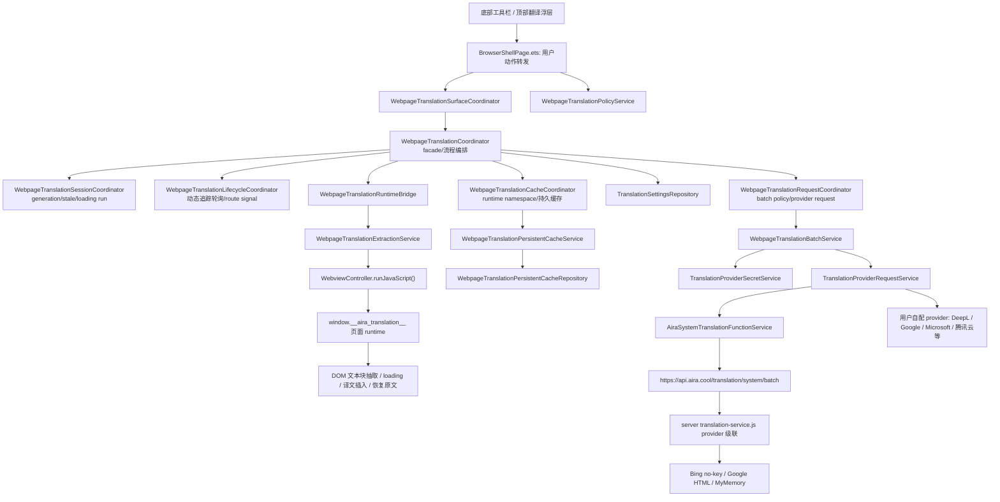

# Aira 当前网页翻译架构调研

本文基于 2026-08-27 本地仓库代码整理，范围是 Aira 现有网页翻译功能如何触发、如何抽取网页文字、如何请求翻译、如何回写页面、如何缓存、如何显示状态，以及它和前面研究的华为浏览器网页翻译方案有什么区别。

## 一句话结论

Aira 当前网页翻译是一个应用层自研方案：ArkUI 浏览器壳层提供入口和浮层，`WebpageTranslationCoordinator` 负责翻译任务编排，ArkWeb `WebviewController.runJavaScript()` 注入 `window.__aira_translation__` 页面 runtime 来扫描和改写 DOM，翻译请求再走 Aira 系统服务或用户配置的第三方 provider。它不是 ArkWeb 内置翻译能力，也不是像华为浏览器那样完整的系统扩展模块。

## 总体架构



当前实现可以拆成五层：

| 层 | 主要文件 | 当前责任 |
| --- | --- | --- |
| UI 入口和状态展示 | `AiraBrowser/entry/src/main/ets/app/pages/BrowserShellPage.ets`, `AiraBrowser/entry/src/main/ets/app/components/translation/WebpageTranslationPanel.ets`, `AiraBrowser/entry/src/main/ets/app/components/browser/BrowserTopFloatingPromptHost.ets` | 提供“翻译网页”入口、顶部浮层、取消、恢复原文、双语/仅译文、目标语言选择；页面文件主要做事件转发和状态绑定。 |
| Surface owner | `AiraBrowser/entry/src/main/ets/core/translation/WebpageTranslationSurfaceCoordinator.ets` | 接管翻译面板 origin、panel surface 是否仍属于当前 tab/url、tabs sheet 打开时隐藏 prompt、异步回调 current-page 校验等 surface 决策。 |
| 入口策略 owner | `AiraBrowser/entry/src/main/ets/services/translation/WebpageTranslationPolicyService.ets` | 统一承接手动翻译入口资格、active provider 解析、首次云端 disclosure、隐私标签开关、站点/语言规则、自动提示/自动翻译资格和 disclosure preferences patch。 |
| 翻译流程 facade | `AiraBrowser/entry/src/main/ets/core/translation/WebpageTranslationCoordinator.ets` | 保留外部 API 和主要流程编排：检查设置/provider/controller，抽取文本，推断语言，派发给 policy/cache/request/lifecycle/session owner，构造 panel 状态。 |
| Session owner | `AiraBrowser/entry/src/main/ets/core/translation/WebpageTranslationSessionCoordinator.ets` | 持有 generation、stale 判断和 loading run id，避免旧任务、旧 loading 状态污染当前网页。 |
| Lifecycle owner | `AiraBrowser/entry/src/main/ets/core/translation/WebpageTranslationLifecycleCoordinator.ets` | 持有动态翻译暂停/恢复、轮询 timer、page signal 和 route signal，当前接管动态 pending/SPA route 轮询；page begin/end/FCP/FMP 接入仍是后续增强。 |
| Request owner | `AiraBrowser/entry/src/main/ets/core/translation/WebpageTranslationRequestCoordinator.ets` | 持有 batch request、provider batch policy、batch budget、Aira 系统翻译批次节流和 provider 请求取消。 |
| Cache owner | `AiraBrowser/entry/src/main/ets/core/translation/WebpageTranslationCacheCoordinator.ets` | 持有 runtime cache namespace、持久缓存 context、水合、存储、cached/uncached item 拆分。 |
| Runtime bridge | `AiraBrowser/entry/src/main/ets/services/web/WebpageTranslationRuntimeBridge.ets` | 作为 native translation subsystem 调用页面 runtime 的统一入口；当前薄封装低层 executor，后续 command/result 协议和 JavaScriptProxy/document-start 能从这里扩展。 |
| Runtime models | `AiraBrowser/entry/src/main/ets/services/web/WebpageTranslationRuntimeModels.ets` | 定义 text item、extraction result、apply result、mutation result 等跨 provider/cache/language/runtime 共用的协议模型，避免上层依赖低层 ArkWeb executor 文件。 |
| ArkWeb JS executor | `AiraBrowser/entry/src/main/ets/services/web/WebpageTranslationExtractionService.ets` | 安装页面 runtime；封装 `extractVisibleBatch()`、`extractPendingBatch()`、`applyTranslations()`、`markLoading()`、`restoreOriginals()` 等 `runJavaScript()` 调用；解析 JS 返回 JSON。 |
| 页面 DOM runtime | `AiraBrowser/entry/src/main/ets/services/web/WebpageTranslationRuntimeScriptService.ets` | 生成注入脚本；维护 `nodeMap/originals/translated/pending/loading/translationCache`；扫描 DOM；插入译文节点；切换显示模式；监听 MutationObserver/IntersectionObserver/SPA route。 |
| Provider/后端 | `AiraBrowser/entry/src/main/ets/services/translation/*`, `server/src/services/translation-service.js` | 客户端 provider 请求、密钥读取、签名、错误归类；Aira 系统翻译通过 `api.aira.cool` 后端级联第三方服务。 |

## 当前手动翻译流程

### 1. 入口可见性

底部工具栏的“翻译网页”动作来自 `BrowserBottomPanelActionCatalog.ets`，入口可用性由 `WebpageTranslationEntryViewModel.canShowToolbarEntry()` 判断。当前判断条件很轻：只要当前是 Web 页面、Web 页面可见，或 action target URL 里有 `http/https`，并且 tabs sheet 没打开，就可以展示入口。

这意味着入口层主要判断“有没有可操作网页 surface”，不是在入口处做完整的 provider、隐私模式、语言规则判断。真正能不能翻译，后面由 coordinator 和 settings 再判断。

### 2. BrowserShellPage 做动作转发

用户点击后，`BrowserShellPage.ets` 的核心路径是：

```text
openWebpageTranslationPanel()
  -> WebpageTranslationCoordinator.openPanelFromToolbar()

handleWebpageTranslationPrimaryAction()
  -> translateCurrentWebpage()
  -> WebpageTranslationPolicyService.resolveManualTranslationDecision()
  -> runWebpageTranslationForCurrentPage()
  -> WebpageTranslationCoordinator.translateCurrentPage()
```

这里还有几个重要保护：

- 非全量模式会由 `WebpageTranslationPolicyService` 给出拦截 decision，页面只负责 toast。
- 隐私标签页如果未开启 `allowInPrivateTabs`，以及当前站点命中 `never_translate_site` 规则，也由 `WebpageTranslationPolicyService` 给出拦截 decision。
- 第一次把当前页面文字发送到云端 provider 前，会由 `WebpageTranslationPolicyService` 判断并弹 `确认网页翻译` disclosure，用户同意后通过该 service 构造 preferences patch，把 `firstCloudDisclosureAcceptedAt` 写入设置。
- 每次启动翻译会记住 `expectedTabId` 和 `expectedUrl`。后续异步 state 回调会通过 `WebpageTranslationSurfaceCoordinator.isPageCurrent()` 校验，避免旧页面翻译状态更新到新页面。
- Aira 系统翻译不读取 Aira 会员态，也不向翻译后端发送 Huawei UID 或账号 token。

### 3. Session owner 建立一次任务 generation

`WebpageTranslationCoordinator.translateCurrentPage()` 是主入口。它开始时会：

```text
lifecycleCoordinator.resumeDynamicTranslation()
lifecycleCoordinator.stopDynamicTranslationPolling()
requestCoordinator.cancelActiveRequests()
taskGeneration = sessionCoordinator.nextTaskGeneration()
```

`WebpageTranslationSessionCoordinator` 持有 `generation` 和 `loadingRunId`。取消、重新翻译、关闭 panel 等都会推进 generation；翻译过程中每个异步阶段都会检查 `isStale(taskGeneration)`，旧任务结果不会继续 apply 到页面。

Coordinator 不再直接调用低层 ArkWeb JS executor，而是通过 `WebpageTranslationRuntimeBridge` 调用页面 runtime 命令。

### 4. 检查设置和 provider

当前设置来自 `TranslationSettingsRepository`，默认是：

```text
enabled: true
offerToTranslate: false
allowInPrivateTabs: false
preferredTargetLanguage: zh-CN
activeProviderId: aira_system_translation
providers: [Aira 系统翻译]
```

`TranslationSettingsRepository` 会强制内置 `Aira 系统翻译` provider，且默认 active provider 指向它。Coordinator 只要求 provider 存在且 `status === 'configured'`；没有 provider 或配置不完整时，panel 进入 error state。

### 5. 注入页面 runtime 并抽取可见文本

Coordinator 通过 `WebpageTranslationRuntimeBridge.configureCache()` 先安装页面 runtime，并设置页面临时缓存 namespace。随后调用：

```text
extractVisibleBatch(controller, initialNodeLimit, initialCharLimit)
```

默认策略不是一次扫完整网页，而是优先扫当前可见区域附近。具体阈值由 `TranslationProviderBatchPolicyService` 按 provider 决定，例如：

| provider | 首批节点上限 | 首批字符上限 | 单批字符预算 |
| --- | ---: | ---: | ---: |
| `aira_system` | 220 | 12000 | 12000 |
| `google_cloud` | 220 | 30000 | 30000 |
| `microsoft` / `deepl` | 240 | 45000 | 45000 |
| `tencent_cloud` | 160 | 12000 | 5800 |
| `baidu` / `youdao` | 120 | 6000 | 1800 |
| `custom_http` | 120 | 6000 | 4500 |

页面 runtime 返回结构大致是：

```json
{
  "url": "https://example.com",
  "lang": "en",
  "title": "Example",
  "items": [
    {
      "id": "b_1",
      "text": "Original text",
      "charLength": 13,
      "order": 0,
      "score": 100,
      "nearViewport": true,
      "top": 320
    }
  ],
  "diagnostics": {
    "mode": "visible_blocks",
    "candidateCount": 20,
    "selectedCount": 8,
    "selectedChars": 2000,
    "pageScrollable": true
  }
}
```

如果没有可翻译文本，panel 直接显示“当前可见区域没有可翻译文字”。

### 6. 推断源语言

源语言由 `WebpageTranslationLanguageService` 推断：

- 先读取页面 `document.documentElement.lang`。
- 再对抽取文本样本做简易字符统计：CJK、日文假名、韩文、拉丁字符和拉丁词数。
- 如果文本检测足够可靠，会优先信任文本；否则回退到页面声明语言。

当前识别主要覆盖 `zh`、`ja`、`ko`、`en`。识别不到语言时不会发请求。

源语言识别后还会再经过 `WebpageTranslationPolicyService.resolveSourceLanguageDecision()`：

- `never_translate_site`：当前网站不翻译。
- `never_translate_language`：当前语言不翻译。
- `always_translate_language`：允许继续，并可用规则里的 `targetLanguageCode` 覆盖本次目标语言。

### 7. 命中持久缓存先 apply

`WebpageTranslationCacheCoordinator` 会构造 runtime cache namespace 和持久缓存上下文：

```text
providerNamespace = "{templateId}:{providerId}:{model}:v1"
sourceLanguage = inferred source
targetLanguage = preferred target
```

`WebpageTranslationPersistentCacheService.hydrateItems()` 会按原文标准化 hash 查本地文件缓存。缓存命中的 item 直接变成 `cachedTranslatedText`，随后由 cache coordinator 生成 apply item，通过 `applyCachedTranslations()` 先回写 DOM，不走 provider 请求。

持久缓存存放在应用 files 目录下的 `webpage-translation-cache`，分 64 个 shard，每个 shard 最多 500 条或约 180000 文本字符，按 `lastUsedAt` 裁剪。

### 8. 未缓存文本分批请求 provider

未缓存 items 会先按“靠近视口优先、top 坐标优先、原始 order 兜底”排序，再由 `WebpageTranslationRequestCoordinator` 根据 provider 策略切成 batch。

每个 batch 的处理顺序是：

```text
markItemsLoading()
  -> batchService.translateBatch()
  -> storeTranslationsInPersistentCache()
  -> runtimeBridge.applyTranslations()
  -> clearItemsLoading()
  -> onState(progress)
```

`markItemsLoading()` 和 `clearItemsLoading()` 对应页面 runtime 的正文 loading 节点。也就是说当前代码已经不只是顶部浮层 loading，而是会在未缓存段落旁边插入轻量 loading；缓存命中段落不会闪 loading。

如果 provider 失败：

- 若已经有缓存命中或部分译文成功应用，则当前 batch 会 `markFailed()`，并以“部分翻译”状态返回。
- 若还没有任何译文应用，则抛出 provider error，panel 进入 error。

### 9. 回写 DOM 后进入动态追踪

初始可见批次完成后，Coordinator 会调用：

```text
lifecycleCoordinator.startDynamicTranslationPolling()
```

页面 runtime 会安装：

- `MutationObserver`：监听新增节点和文本变化，写入 `state.pending`。
- `IntersectionObserver`：对懒加载/即将进入视口的文本块做 pending 标记。
- History API hooks：包装 `history.pushState()` / `replaceState()`，监听 `popstate` / `hashchange`。

`WebpageTranslationLifecycleCoordinator` 持有 Native 侧每 1400ms 轮询的 timer 和 page/route signal 版本：

- 如果 `routeSignalVersion` 变化，认为 SPA route 变了，重新跑 `translateCurrentPage()`。
- 如果只有 `pageSignalVersion` 变化，则 `extractPendingBatch(controller, 8, 800)`，只翻译少量新增/新可见文本。

当前 `translateAndApplyPageQueues()` 里有全页队列翻译能力，但在当前代码路径中没有被调用；实际用户路径主要是“可见区域首批 + 动态 pending 增量”。

## 页面 runtime 如何抽取和改写网页

`WebpageTranslationRuntimeScriptService` 生成一个版本号为 `wrapper_cache_v16_loading` 的页面脚本，挂在：

```text
window.__aira_translation__
```

### runtime 状态

页面脚本维护这些核心状态：

| 字段 | 作用 |
| --- | --- |
| `nodeMap` | 翻译 id 到真实 DOM node/element 的映射。 |
| `originals` | id 到原文文本，apply 前后用于校验和恢复。 |
| `translated` | id 是否已有有效译文。 |
| `translationCache` | 当前页面内的临时原文到译文缓存。 |
| `cacheNamespace` | 页面临时缓存命名空间，避免不同 provider/目标语言混用。 |
| `displayMode` | `bilingual` / `translation_only` / `original`。 |
| `pending` | 动态新增或懒加载候选块。 |
| `loading` / `failed` | 正文 loading/失败节点状态。 |
| `observer` / `visibilityObserver` | 动态内容和可见性观察器。 |
| `pageSignalVersion` / `routeSignalVersion` | native 轮询用的页面/路由变化信号。 |

### DOM 选择规则

runtime 不是简单 `document.body.innerText`，而是按块级文本抽取：

- 跳过 `script/style/input/textarea/select/svg/canvas/video/audio/iframe/pre/time` 等元素。
- 跳过 `contenteditable`、`translate="no"`、`.notranslate`、CodeMirror、Monaco、ProseMirror、已有 `.aira-translation-result`。
- 跳过不可见、尺寸为 0、`aria-hidden`、`hidden` 的元素。
- 对 `p/h1-h6/li/td/th/dd/dt/blockquote/figcaption/caption` 等 leaf block 优先作为翻译块。
- 对混合 inline 内容，会尝试创建 `span[data-aira-translation-wrap="true"]` 包起来，便于作为一个翻译单元。
- 对 `nav/footer` 和疑似分享/订阅/工具栏文本做降权或跳过。
- 根据 article/main/content/story/detail 容器、标题/段落标签、文本长度、视口位置计算 score。

首批 `extractVisibleBatch()` 只取 near viewport；`extractPageQueue()` 可取更大队列；`extractPendingBatch()` 只取 pending 里的少量新块。

### 回写策略

回写不是直接替换原文，而是在原元素后面插入：

```text
.aira-translation-result.notranslate
```

并记录：

```text
data-aira-original-text
data-aira-translated-text
data-aira-display-mode
translate="no"
```

默认仅译文模式下：

- 原元素隐藏。
- 仅显示译文节点。

切换为双语对照模式后：

- 原文保留。
- 块级内容在原文下方显示译文。
- inline 内容在原文后方显示译文。

仅译文模式下：

- `showTranslationOnly()` 会隐藏原元素，并显示译文节点。

恢复原文时：

- `restoreOriginals()` 隐藏或移除译文/临时节点，恢复原元素显示。

### 安全回写校验

`applyTranslations()` 回写前会检查：

- id 对应 node 是否还存在。
- 译文是否为空。
- 当前 DOM 可见文本是否仍和抽取时原文匹配。
- 如果译文标准化后等于原文，则记为 noop，但也算处理过，避免反复请求。

这能降低 SPA、懒加载或 DOM 变化导致“译文插错位置”的概率。

## Provider 请求架构

### 两条 provider 路径

Aira 当前有两类 provider：

1. `aira_system`
   - 客户端请求 `https://api.aira.cool/translation/system/batch`。
   - 客户端不需要用户填密钥。
   - 后端只在公开 provider 之间级联，不使用 Aira 自付费翻译 API。

2. 用户自配 provider
   - `custom_http`、DeepL、Google Cloud、Microsoft、百度、有道、腾讯云、阿里云、火山等。
   - 客户端直接从 HarmonyOS app 请求对应 provider。
   - 密钥通过 `TranslationSecretStore` 存在系统 AssetStore，设置 JSON 只保留 secret alias。

`TranslationProviderRequestService` 统一负责构造请求、签名、发送 HTTP、解析响应、归类错误。

### 用户自配 provider

当前支持：

| provider | 请求特点 |
| --- | --- |
| `custom_http` | POST 用户 HTTPS endpoint，body 为 `{ sourceLanguage, targetLanguage, texts }`，响应兼容 `items/translations/results/data`。 |
| `deepl` | 默认 `https://api-free.deepl.com/v2/translate`，`DeepL-Auth-Key`。 |
| `google_cloud` | 默认 `https://translation.googleapis.com/language/translate/v2`，API key query。 |
| `microsoft` | 默认 Microsoft Translator v3，subscription key + region。 |
| `baidu` | 百度开放平台，`appid + q + salt + secretKey` MD5。 |
| `youdao` | 有道 v3 签名，SHA256。 |
| `tencent_cloud` | 腾讯云 API3 TC3-HMAC-SHA256，`TextTranslateBatch`。 |
| `alibaba_cloud` | 阿里云机器翻译，HMAC-SHA1 query 签名。 |
| `volcano` | 火山引擎，HMAC-SHA256 请求签名。 |

请求超时统一是 20s。取消翻译时 `cancelActiveRequests()` 会 destroy 当前 active HTTP requests。

### Aira 系统翻译后端

客户端 `AiraSystemTranslationFunctionService` 发请求时 body 包含：

```json
{
  "sourceLanguage": "en",
  "targetLanguage": "zh-CN",
  "source": "app_translation",
  "texts": [{ "id": "b_1", "text": "Original text" }]
}
```

该请求不携带 Huawei UID、账号 token 或会员信息。Aira 系统翻译对所有使用者走相同的公开 provider 策略。

后端入口在 `server/src/app.js`：

```text
POST /translation/system/batch
  -> translationService.handleSystemTranslationBatch()
```

服务端级联顺序是：

```text
Bing no-key batch
  -> Google HTML
  -> MyMemory
```

公开 provider 都有环境变量开关。item/字符数值是单个第三方物理请求的拆组大小，不再是整批准入限制；超过时后端继续拆组处理。Bing、Google 和 MyMemory 默认都最多 4 个在途请求。Bing/Google 物理组只对超时、临时网络错误和 HTTP 5xx 立即重试一次，429 和其他明确拒绝不重试；全部 worker 收敛后才切到下一个 provider：

| 后端 provider | 默认拆组策略 |
| --- | --- |
| Bing no-key | 按 20 条/约 800 字符分组，直接请求 `edge.microsoft.com/translate/translatetext?isEnterpriseClient=false`，不获取 Microsoft token；单组 3 秒超时。 |
| Google HTML | 按 20 条/约 800 字符分组，请求体为独立 `<pre>` 字符串数组，保持输入与输出一一对应。 |
| MyMemory | 逐项请求并做有限并发，要求 source/target 都不是 `auto`。 |

如果所有公开 provider 都不适用或失败，后端返回 `public_translation_unavailable`。后端不再读取腾讯云翻译密钥，也没有 Pro premium fallback。翻译端点只继承全站常规的每 IP 请求频率保护；它不是翻译字符额度，也不会在客户端建立跨请求的 provider 退避。

## 缓存设计

当前有两层缓存。

### 页面临时缓存

页面 runtime 里有 `state.translationCache`，key 是：

```text
cacheNamespace + "::" + normalize(originalText)
```

它来自两处：

- 新翻译成功后 `putCachedTranslation()`。
- 已有 `.aira-translation-result[data-aira-original-text]` 被 `hydrateTranslationCacheFromDom()` 重新吸收。

它只服务当前页面 runtime 生命周期，主要用于显示模式切换、恢复译文和避免同一页面重复请求。

### ArkTS 持久缓存

`WebpageTranslationPersistentCacheRepository` 把记录写到：

```text
{filesDir}/webpage-translation-cache/{version}-{shard}.json
```

key 由以下字段组成：

```text
providerNamespace
sourceLanguage
targetLanguage
hash(normalizedSourceText)
```

record 同时保存 `sourceHash`，hydrate 时会二次比对，避免 hash key 或标准化差异造成错配。

## UI 状态模型

`WebpageTranslationPanelState` 的核心字段：

```text
visible
status: idle / extracting / translating / partially_translated / translated / restored / error
displayMode: none / bilingual / translation_only / original
providerTemplateId
providerDisplayName
sourceLanguage
targetLanguage
translatedCount
canTranslate
canRestore
canCancel
```

顶部浮层由 `BrowserTopFloatingPromptCoordinator` 决定是否把 `webpage_translation` 作为当前 active prompt。`BrowserTopFloatingPromptHost` 再把 state 交给 `WebpageTranslationPanel` 渲染。

面板操作包括：

- 翻译 / 重新翻译
- 取消
- 显示原文
- 双语对照
- 仅显示译文
- 目标语言选择
- 关闭

目标语言选择通过自定义底部 overlay 展示 `WebpageTranslationTargetLanguageSheet`，保存后更新 `TranslationSettingsRepository.preferences.preferredTargetLanguage`。

## 和华为浏览器方案的关键区别

前一份华为浏览器研究结论里，华为是独立 `@hwbr/extension_translate` 扩展。它由 native extension 负责生命周期、UI、配置、限额、缓存、云端请求和 JS bridge；页面 JS 负责 DOM 扫描和替换；还包含图片翻译、云端配置、限额表、token 校验和插件注册生命周期。

Aira 当前方案和它的区别：

| 维度 | 华为浏览器 | Aira 当前实现 |
| --- | --- | --- |
| 模块形态 | 独立 `extension_translate` 扩展。 | Aira app 内的 core/services/data/components 组合。 |
| JS bridge | `TranslationPlugin` 注册动作，页面 JS 主动向 native 请求翻译。 | Native 通过 `runJavaScript()` 调页面函数；页面 runtime 不通过 JS proxy 主动请求 native 翻译。 |
| 翻译触发 | 生命周期管理里含自动翻译、FCP/FMP 延迟、tab lifecycle。 | 当前主路径是手动翻译；`offerToTranslate` 存在设置字段但未看到完整自动提示/自动翻译链路。 |
| 文本请求位置 | 页面 JS 通过 bridge 发批次给 native/plugin。 | Coordinator 抽取 items 后在 ArkTS native 侧批量请求 provider。 |
| 图片翻译 | 有图片翻译、图片缓存、图片云端查询。 | 当前只做文本网页翻译，没有图片翻译链路。 |
| 限额 | 本地 RDB 记录字符/图片限额。 | 客户端不维护翻译字符额度或失败退避；provider 错误直接反馈给当前批次。页面抽取预算和服务端拆组大小只用于运行稳定性，不代表产品额度。 |
| 缓存 | native 文本/图片缓存 + 云端缓存查询。 | 页面临时缓存 + ArkTS 文件分片持久缓存。 |
| Provider | 华为 UserExp 云服务。 | Aira 系统后端级联 + 用户自配 provider。 |
| 生命周期隔离 | extension lifecycle manager 管 tab/page/plugin。 | `WebpageTranslationSurfaceCoordinator` 记 origin，`WebpageTranslationSessionCoordinator` 管 generation/stale，`WebpageTranslationLifecycleCoordinator` 管动态轮询和 route/page signal，页面 runtime observer 追动态内容。 |

所以 Aira 更像“浏览器壳层内的网页翻译特性”，华为更像“浏览器平台扩展能力”。Aira 的好处是实现可控、provider 可换、适合快速迭代；短板是自动翻译、图片翻译、Web->native bridge token 和深度系统集成没有华为那么完整。

## 当前缺口和风险

1. `translateAndApplyPageQueues()` 已接入主路径，但仍受最大轮数和总字符预算保护；极长页面仍需要滚动 pending batch 继续推进，不承诺一次性全页无上限翻译。

2. `allowInPrivateTabs`、`never_translate_site`、`never_translate_language`、`always_translate_language.targetLanguageCode` 已经进入 `WebpageTranslationPolicyService` 决策，并接入手动翻译/执行流；但 `offerToTranslate` 仍只是 policy API，自动提示和自动翻译还没有完整 lifecycle 入口，`WebpageTranslationEntryViewModel` 的入口可见性也还没有消费 private/rule policy。

3. Aira 系统翻译依赖公开或半公开接口形态，例如 Bing no-key consumer endpoint、Google HTML key 抓取和 MyMemory。这些链路不产生 Aira 自付费翻译 API 成本，但稳定性、可用额度和合规边界弱于正式商用 API；后端只有公开源失败级联，没有付费兜底。

4. 页面 DOM 注入方式会受到站点结构影响。虽然 runtime 已经规避很多编辑器、不可见元素、nav/footer、layout-sensitive 容器，但复杂 SPA、虚拟列表、强 CSS 布局、Shadow DOM 仍可能出现漏翻、重复、错位或布局扰动。

5. 当前页面 runtime 是通过 `runJavaScript()` 安装到页面上下文，不是 document-start 持久注入；它适合用户手动触发后的翻译，但对非常早期的 SPA route、站点 CSP/脚本隔离、页面快速重建，需要靠后续轮询和重新安装兜底。

6. 用户自配 provider 的密钥虽然存在 AssetStore，但客户端直连 provider 意味着请求签名逻辑和密钥使用都在设备侧完成。安全性强于明文 preference，但弱于把所有第三方密钥放在自有服务端代理。

7. 客户端不再对失败 provider 做跨请求退避；动态网页可能在后续内容变化时再次尝试公开源。请求取消、任务 generation/stale 和服务端通用防滥用限流仍保留。

## 后续建议

1. 明确产品定位：是继续做“手动网页翻译”，还是要对齐华为的“自动提示/自动翻译扩展”。如果做自动翻译，需要补齐 `offerToTranslate`、语言规则、站点规则、隐私标签策略和页面加载生命周期。

2. 如果要更接近“整页翻译”，继续调优 page queue 的 provider policy、轮数、字符预算和文案，避免把受保护的多轮翻译误表达成无限全页翻译。

3. 持续监控公开 provider 的可用性、响应时间和失败码，及时移除失效入口或调整级联顺序；不要重新引入账号 token 或 Aira 自付费 provider。

4. 继续把入口可见性和自动提示也接到 `WebpageTranslationPolicyService`，让 `WebpageTranslationEntryViewModel`、lifecycle prompt、手动执行流消费同一套 policy decision。

5. 如果要增强稳定性，可考虑新增 Web -> native JS proxy，让页面 runtime 能按单段或小批次主动请求 native，这样正文失败重试、懒加载即时翻译、精细进度会更自然。但必须同步引入 session token、origin/context 校验、并发和生命周期设计；当前没有反向 bridge，不能伪造一个无消费者的 token。
