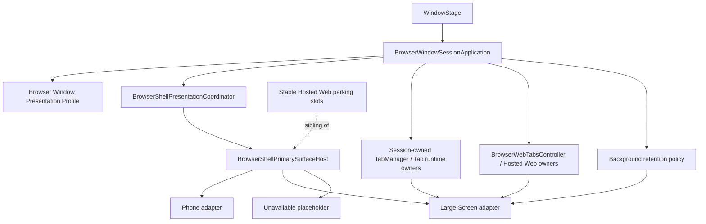

# Aira 大屏 Shell 信息架构与交互契约

状态：Phase 6 设计基线（不包含视觉 token，不启用 Large-Screen catalog）
日期：2026-07-24
适用范围：平板、2in1 和具备键鼠输入的 HarmonyOS NEXT 大屏窗口

这份文档把[华为浏览器大屏架构研究](./huawei-browser-large-screen-ui-architecture-research.md)转成 Aira 的可实现信息架构。它先决定“有哪些区域、每个区域由谁拥有、区域之间怎样协作”，再进入颜色、图标、间距和动效设计。

## 1. 设计结论

Aira 的目标结构是：两套 Shell、一个 Browser Window Session、一个共享 Tab/Web runtime 核心。



关键原则：

1. `shellFamily` 只决定宏观交互模型，不直接决定所有布局细节。
2. 当前窗口尺寸、窗口模式、输入能力和宿主能力决定大屏 Shell 内部的实时策略。
3. Tab、Web runtime、Window Context、后台回收、Window-Open 和 Sync 不因 Shell 变化而复制。
4. `BrowserShellPage.ets` 只挂载 adapter、传递 shaped state 和转发事件；它不计算 tab 宽度、不决定 side panel、不创建 Web controller，也不创建 WindowStage 级 TabManager。
5. Large-Screen adapter 在完整实现前保持 `ready: false`，不能用半成品 UI 覆盖稳定 Phone Shell。

## 2. 事实与工程决策分开

### 已从华为浏览器确认的事实

- `phone` 使用独立的手机页面树，`tablet` 和 `2in1/PC` 进入大屏页面树。
- 大屏壳有独立的 tabs title bar、tab strip、location bar、toolbar、side panel、download/settings 管理页面和键鼠输入层。
- 大屏 presentation 复用共享的 TabLogic、WebComponent/工厂、Ability/Window logic 和 Web runtime primitive。
- tab strip 会根据窗口宽度、固定按钮、系统标题按钮、当前 tab、overflow 和拖拽状态重新计算可见区间。
- 平板与 PC 共用大屏 Shell 家族，但 Tablet style、窄窗口策略、拖拽能力和快捷键提示仍由运行时能力继续分型。
- 下载、书签、历史、设置等管理页面也需要大屏 presentation，不应只改浏览网页的主壳。

证据索引集中在研究文档第 5、7、8、9、10 节；研究对象是本地华为浏览器 HAP，不能直接证明第三方应用拥有同样的系统多窗口或 PopupAbility 能力。

### Aira 的工程决策

- 首个可交付的大屏 Shell 只负责浏览器主窗口的信息架构，不改变 ADR-0040 Window-Open/BFCache 合约。
- WebApp chrome-less adapter 暂不进入本阶段；当前 WebApp immersive mode 继续使用已有 Browser Shell。
- 先实现一个深的 `BrowserLargeScreenPresentationViewModel`（名称可在实现时落定），让 tab strip、top chrome、side panel 和状态栏共享同一份 presentation snapshot；不新增多个平级 coordinator。
- 大屏管理页面优先复用现有 domain owner 和 repository，再增加 presentation adapter。

## 3. 主窗口信息架构

大屏主窗口按“浏览器 chrome → tab strip → 内容工作区 → 辅助面板/状态区”的顺序组织。

| 区域 | 主要内容 | Presentation owner | 明确不负责 |
| --- | --- | --- | --- |
| Top Chrome | 返回/前进、刷新、地址栏、搜索建议、窗口级动作、键盘焦点入口 | Large-Screen presentation view model + existing browser action owners | Tab 真相、Web controller、导航策略 |
| Tab Strip | tab 标题、favicon、选中态、关闭、new tab、overflow、拖拽反馈 | Large-Screen tab-strip projection | 创建/销毁 Web runtime、跨窗口 attach/detach |
| Main Web Stage | Home、Web、原生管理页的主内容槽 | Large-Screen primary surface adapter；内容由现有 owners 提供 | 创建/移动/销毁 Hosted Web slots |
| Side Panel | 书签/扩展/辅助工具等可停靠面板 | Large-Screen side-panel presentation state | Tab 列表、Web runtime 生命周期、Sync 数据 |
| Bottom Status | 下载/加载/安全状态/快捷提示等低优先级状态 | Large-Screen presentation view model | 业务操作决策、全局 modal |
| Global transient surfaces | context menu、dialog、popup、sheet、info bar | 现有 transient surface owners + Shell host | 另起一套 bottom-sheet host 或独立 Web controller |
| Management pages | 书签、历史、下载、设置、关于、首页 | 现有 domain owner + 大屏 presentation adapter | 复制 repository、Sync provider 或 Tab runtime |

稳定 Host 的 Hosted Web parking slots 位于 Main Web Stage 的 presentation host 旁边，而不是放进某一个 adapter。这样切换 presentation 时，Web controller 和 NodeContainer 的 ownership 不会随着 ArkUI adapter 挂载而改变。

## 4. 大屏窗口内部的响应式档位

Shell family 选定后，不再用一个 `isPcUi` 布尔值覆盖所有决策。至少保留以下三个正交 profile：

```text
shellFamily       = phone | large_screen
windowProfile     = compact | medium | expanded | free_window | subwindow
inputProfile      = touch | pointer | keyboard_pointer
hostCapabilities  = single_window | multi_window | popup_window | devtools
```

窗口档位只描述策略，不在本阶段写死具体 vp 阈值。阈值需要结合真实平板/2in1 设备和 HarmonyOS WindowStage 测量后确定。

| 档位 | 目标行为 | 不允许的行为 |
| --- | --- | --- |
| `expanded` | 显示完整 tab strip、完整地址栏和可选 side panel；保留更多操作入口 | 不能让 Web 区域被固定 chrome 挤到不可用 |
| `medium` | 压缩普通 tab、保留选中 tab，必要时启用 more；toolbar 进入密集布局 | 不能复制一套新的 TabManager |
| `compact` | 关闭或收起 side panel，减少次要按钮，地址栏保持可用 | 不能自动切回 Phone Shell |
| `free_window` | 扣除系统标题按钮和 avoid area，重新计算 tab/toolbar 资源 | 不能假设设备类型代表固定窗口宽度 |
| `subwindow` | 使用子窗口专用 chrome 安全区和 popup/菜单锚点 | 不能未经授权改写 Window-Open/BFCache 路径 |

档位变化只更新 presentation snapshot；不销毁 Session，不重建 tab record，不移动 Hosted Web controller。

## 5. Tab Strip 交互契约

Tab strip 是本阶段最值得先实现的非视觉模块，因为它把华为大屏最明显的特殊处理变成了可验证的纯 presentation 计算。

### 输入

- 当前窗口可用宽度。
- 系统标题按钮和 avoid area 占用宽度。
- 固定按钮占用宽度：new tab、tab menu、window actions 等。
- tab records 的显示字段：标题、favicon、loading、muted、private、active、closable。
- 当前 active tab。
- `windowProfile`、`inputProfile` 和 tab drag capability。

### 输出

```text
LargeScreenTabStripPresentation {
  visibleTabIds
  hiddenTabCount
  selectedTabId
  tabFrames
  overflowVisible
  newTabFrame
  dragState
  closeConfirmationRequired
}
```

### 规则

1. 先扣除系统标题按钮、固定按钮和外边距，再计算 tab 可用宽度。
2. active tab 可以拥有更高的最小宽度，普通 tab 在 `medium/compact` 档位压缩。
3. 可用宽度不足时先缩 tab，再启用 overflow；不能让 tab 文本把地址栏或 Web stage 挤出窗口。
4. overflow 只改变可见 tab projection，不改变 tab record 和 runtime retention。
5. 拖拽 presentation 记录 id、起止索引、offset、display position；最终排序动作仍交给现有 Tab owner。
6. tab 拖拽、鼠标中键、右键菜单和快捷键必须先经过 `inputProfile` / `hostCapabilities` gating。
7. 不允许 tab card 直接调用 `WebviewController`、`NodeContainer` 或 discard/restore API。

### 建议的深模块接口

实现时优先让一个 presentation view model 暴露一个窄接口：

```text
resolveTabStripPresentation(windowFacts, tabSnapshot, inputFacts)
  -> LargeScreenTabStripPresentation
```

宽度、overflow、拖拽和选中态的复杂性都藏在实现里；页面和 tab card 只消费 snapshot。不要为“宽度计算”“overflow 状态”“拖拽几何”各建一个平级 coordinator。

## 6. Top Chrome 交互契约

Top Chrome 采用“稳定主入口 + 可压缩次要动作”的层次：

1. 导航主动作：back、forward、reload。
2. 地址/搜索主入口：地址栏、搜索建议、切换已有 tab 的建议项。
3. 当前页面状态：安全状态、加载状态、私密边界、WebApp/原生页状态。
4. 次要动作：书签、下载、分享、翻译、页面工具、设置入口。
5. 窗口动作：new tab、tab menu、new window 等仅在宿主能力允许时出现。

地址栏和工具栏不在页面内判断 tablet/PC。它们只消费 `windowProfile`、`inputProfile` 和 resolved action presentation。平板样式与 PC 样式可以是同一个 adapter 内的策略对象，但不能扩散成页面里的多处 `if`。

键盘焦点顺序需要明确：

```text
window chrome -> tab strip -> address bar -> page Web content -> side panel
```

`BrowserKeyboardShortcutCoordinator` 继续作为快捷键语义 owner；大屏只增加 keymap/presentation profile 和可见提示，不复制快捷键 policy。

## 7. Main Web Stage 与 Home/管理页

Main Web Stage 是一个工作区，不等于“总是显示 WebComponent”。它需要投影三类内容：

- Browser Home：继续使用现有 Home semantic/runtime owner。
- 普通 Web：继续使用现有 BrowserWebTabsController 和 stable Hosted Web slots。
- 原生管理页：书签、历史、下载、设置、关于等继续进入现有 tab/page model，再由大屏 adapter 投影。

大屏 adapter 只决定内容槽的几何、可见性和 chrome 组合；它不决定“当前 tab 是否应该存活、是否恢复、是否丢弃”。

Home 与普通 Web 的切换应保持一个主工作区，不因为大屏壳而增加第二份 Home runtime 或第二份 Web runtime。

## 8. Side Panel 契约

Side panel 是大屏专属的 presentation surface，建议使用以下状态：

```text
sidePanel = closed | open | pinned
sidePanelPosition = left | right
sidePanelContent = bookmarks | extensions | page_tools | custom
```

第一阶段只实现 presentation 状态和内容槽，不实现新的数据域。

规则：

- `open/close/pin/switchPosition` 由一个 side-panel presentation owner 统一处理。
- side panel 内容以 adapter/view model 方式读取现有书签、扩展或页面工具 owner 的 snapshot。
- side panel 打开时重新计算 Web stage geometry，但不移动 Hosted Web parking ownership。
- 窄窗口优先自动收起 side panel；这是窗口档位策略，不是 Shell family 切换。
- side panel 中的操作通过既有 action/coordinator 转发，不能直接写 repository 或 Tab runtime。

## 9. 输入、焦点与 surface 选择

大屏不是只增加键盘快捷键，还要把输入语义独立建模：

| 输入事实 | presentation 影响 | 业务动作 owner |
| --- | --- | --- |
| 触摸 | 增大 hit target、保留可拖拽触摸路径 | 现有浏览器 action owner |
| pointer | hover、右键、上下文菜单、中键打开 | 现有 tab/bookmark action owner |
| keyboard + pointer | shortcut hint、焦点环、键盘导航顺序 | `BrowserKeyboardShortcutCoordinator` |
| 无物理键盘 | 隐藏或降低快捷键提示 | presentation view model |
| drag capability 不可用 | 隐藏拖拽 affordance，保留普通点击 | 现有 Tab/Bookmark owner |

Surface 选择遵循语义：

- 普通 chrome popup：锚定 top chrome 或 tab strip。
- context menu：由 pointer/long-press 语义触发。
- dialog：只处理局部确认、权限或认证状态。
- side panel：持久辅助工作区。
- system bottom sheet：继续遵守单一 host 与现有 transient bottom-sheet owner 规则。
- 独立 PopupAbility/detached window：另开授权任务，不在本阶段启用。

### 9.1 平台 facts 的唯一读取入口

大屏 presentation 不从页面猜测“这是电脑还是平板”。事实由
`BrowserWindowPresentationProfileInputService` 统一读取，再交给
`BrowserLargeScreenWindowFactsViewModel` 做档位和输入语义投影。

当前已在本机 API 23 Stage SDK 核对并接入的事实包括：

- `WindowProperties.windowRect/drawableRect`：窗口和可绘制区域尺寸；
- `Window.getTitleButtonRect()`：系统标题按钮区域；
- `Window.isInFreeWindowMode()`：自由窗口状态；
- `Window.isReceiveDragEventEnabled()`：窗口接收拖拽事件的能力；
- `Window.getWindowAvoidArea()` / `avoidAreaChange`：系统避让区变化，并在 window profile 投影前扣除四边安全区；
- `windowSizeChange`、`windowTitleButtonRectChange`、`freeWindowModeChange`：窗口事实变化；
- `@kit.InputKit` 的 `inputDevice.getDeviceList()/getDeviceInfo()`：鼠标、触控板、键盘设备来源和实体设备事实。

输入设备枚举是异步的，因此 facts 回写必须带 WindowStage generation 和 Session id。窗口销毁、重建或切换 Session 后，旧回调直接丢弃；平台 API 不支持或读取失败时只报告未知/false 能力，不使用“电脑默认有鼠标键盘”之类的假设。

## 10. 管理页面的 presentation 方向

管理页面不需要一次性全部重写，但需要遵循统一方向：

| 功能 | 大屏 presentation 目标 | 复用内容 |
| --- | --- | --- |
| 书签 | 左侧树/分类 + 主列表，支持 pointer 多选、拖拽和中键动作 | Bookmark domain、sync、repository |
| 历史 | 搜索 + 日期分组 + 多选操作，支持键盘焦点 | History owner、clear policy |
| 下载 | 列表/分组 + Save As/Open in file manager 能力入口 | Download core、permission、file service |
| 设置 | 左侧导航 + 右侧 detail，避免把手机页面拉伸 | Settings domain、preferences |
| 首页 | 大屏快捷入口、搜索和可选侧栏 | Browser Home semantic/runtime owner |

这些页面应作为后续 presentation adapter 垂直切片，不应在本阶段复制数据服务或 Sync schema。特别是 Sync 架构保持冻结。

## 11. 失败与降级规则

1. 首帧如果 Large-Screen adapter 未 ready，profile 选择 Phone；不能先显示半成品大屏再闪回 Phone。
2. 已选定的 Shell family 在普通 resize、分屏和自由窗口中保持不变，只更新 `windowProfile`。
3. 如果未来已选 family 的 adapter 在运行时不可用，保持上一份完整 presentation 或显示 same-family unavailable surface，不能静默切到另一个 family。
4. stale profile revision、catalog revision 和 adapter generation 不得覆盖当前 snapshot。
5. adapter 失败不影响 Tab/Web runtime semantic state；Session 继续存活。
6. Hosted Web fixed slots 在 presentation 失败时也不被销毁、重建或跨 adapter 搬运。

## 12. 实现顺序

### Slice 1：Presentation ViewModel 与窗口档位

- owner：`BrowserWindowSessionApplication` 下的现有 presentation seam；新增模块必须从属于它。
- 输入：WindowStage facts、Presentation Profile、input/host capability facts、tab summary。
- 输出：统一 `LargeScreenPresentationSnapshot`，包含 `windowProfile`、top chrome、tab strip、side panel、bottom status 的 shaped state。
- 验证：纯 ArkTS build、architecture guard、Window-Open guard；不启用 catalog。

### Slice 2：Tab Strip projection

- 实现可独立验证的 tab width/overflow/drag presentation 计算。
- 只消费 TabManager snapshot，不移动 Web runtime。
- 先用结构化 placeholder，不引入视觉 token。

### Slice 3：Top Chrome skeleton

- 把 top chrome slot 填成可交互的结构骨架。
- 快捷键继续复用 `BrowserKeyboardShortcutCoordinator`。
- 地址栏 suggestion/switch-existing-tab 通过现有搜索/导航 owner 转发。
- action id 通过 `BrowserLargeScreenTopChromeActionBridge` 翻译到既有快捷键、分享和窗口 owner；Top Chrome surface 本身不直接调用 Web controller、TabManager 或 repository。

### Slice 4：Side Panel 与 transient surface

- side panel open/close/pin/position presentation。
- context menu、dialog、popup、sheet 继续复用已有 surface owner。
- 不修改 ordinary `_blank`、OAuth、BFCache 或 PopupAbility 路径。

### Slice 5：管理页面 adapter

- 书签、历史、下载、设置按功能逐个接入大屏工作区。
- 每个切片保持一份 domain owner 和一份 repository。

### Slice 6：启用 Large-Screen catalog

- 只有当完整 adapter、失败面、Hosted Web geometry、键鼠/触摸矩阵都通过后，才将 catalog 的 Large-Screen `ready` 改为 true。
- 需要签名 build、安装和用户实际视觉/交互验收。

## 13. 交付验收矩阵

| 场景 | 预期 |
| --- | --- |
| Phone 首帧 | 现有 Phone Shell 与当前行为不变 |
| 大屏资格但 adapter 未 ready | 仍显示 Phone，不闪烁、不创建半成品大屏 |
| expanded 窗口 | 完整 tab strip/top chrome，side panel 可选 |
| medium 窗口 | tab 压缩、overflow 正确、Web stage 保持可用 |
| free window/subwindow | 扣除系统 title button/avoid area 后重新布局 |
| 无物理键盘平板 | 不显示强制快捷键提示，触摸路径可用 |
| 键鼠 2in1 | 快捷键、hover、右键、中键、拖拽按能力启用 |
| Web runtime | Shell 变化不创建第二套 Web controller/registry |
| background/memory pressure | 继续走现有保护与 discard pipeline |
| ordinary `_blank` / OAuth / BFCache | 行为与 ADR-0040 保持一致 |
| Sync | 不修改冻结 Sync contract |

## 14. 暂不做的事情

- 不在本阶段实现视觉 token、品牌样式、动画时长或最终图标。
- 不启用 WebApp chrome-less adapter。
- 不迁移 Hosted Web parking slots。
- 不实现 detached popup、真多窗口、跨窗口 tab attach/detach 或 DevTools 能力。
- 不修改 Sync、Window-Open/BFCache、后台 discard 保护合约。

## 15. 下一份代码切片

下一步实现 `LargeScreenPresentationSnapshot` 的非视觉 view model 和 tab-strip projection。它应挂在现有 `BrowserShellPresentationCoordinator` 之下，向 `BrowserShellPrimarySurfaceHost` 提供一个小接口，而不是在 `BrowserShellPage.ets` 增加新的判断逻辑。

这一步完成后，再根据真实窗口事实和设备验收确定具体 vp 阈值与视觉设计。
